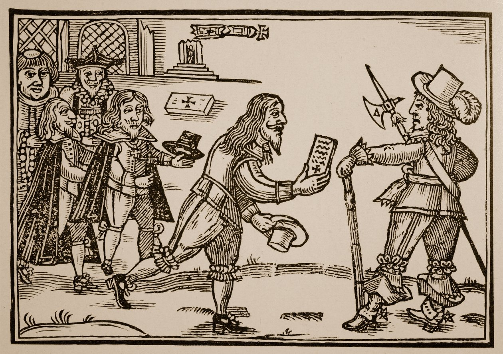

**Case-study 2: Qualitative dimensions**

Let's practice what we have learned during the first session on extracting information from qualitative dimensions. Let's focus on a completely different data set that the one we have used so far. The [Petitioning in Early Modern England](https://petitioning.history.ac.uk) data set consists of 2,847 petitions filed in England between 1573 and 1799 [@waddell2022]. As well as the text itself, it includes information on date, petitioners, topic, administrative responses, etc. Petitions were a crucial mode of communication between the ‘rulers’ and the ‘ruled’, so they provide a vital source for illuminating the concerns of the people, from noblemen to paupers. The data is hosted in this [repository](https://zenodo.org/records/7027693).

::: {.column-margin}  
{width=100% height=100%} 
:::

- Download it into a folder of your choice and read it into R. Remember to set the working directory and load the necessary packages.

- Explore how the data set looks like. How many observations does it contain? What each observations refers to (unit of analysis)? What kind of information does it report about each observation?

- Were the petitions contained in this data set filed all over England or in particular counties?

- What were the two most common topics for filing a petition. Draw a bar plot to visualise this information. Which fraction of all the petitions these two topics represent? Use also the information of subtopic to shed more light on this issue.

- Imagine that you are especially interested in "poor relief". Can you provide more information about who was filing these petitions and the type of response they got from the Royal authorities.

<!--
# Solution: 

The downloaded files are contained in a folder with a very long name that you can perhaps simplify it. Once you have done so and set the working directory in R, you can use `list.files()` to tell you what folders and files are located in a given folder.^[Typing the command with nothing in parentheses R will show you the contents of the working directory. By contrast, `list.files("/data)"` will list the files in the folder named `data`. 

In my case, I put the files in the folder `data-assign`, so I can read in using `read_excel()` (remember to load the package `readxl`).

```{r}
#| warning: false
#| message: false
rm(list=ls())
library(tidyverse)
library(readxl)
data <- read_excel("data-assign/petitions/data/tpop_petitions_petitioners_v1_202208.xlsx")
```

Let's explore how the data set looks like.

```{r}
data
```

As indicated above, this data frame contains 1,728 rows, that is observations. Each row refers to petitions filed in England during the period of study. The unit of analysis is therefore these petitions. There are 19 columns, meaning that there 19 pieces of information about these petitions. Given that we are focusing on qualitative dimensions, we will explore things like the locations where these petitions were filed (*county*), what they refer to (*topic* and *subtopic*), the type of petition (*petition_type*), the name and gender of the petitioner (*petition_gender*) or the response they received (*response_cat*). The data set also includes a textual description of the petition itself (*abstract*).

Regarding the particular questions indicated above, you can list the places or origin of these petitions by using `count()` on the variable *county*.

```{r}
data |> 
  count(county)
```

Doing the same by *topic* and sorting the results in descending order gives you the most important topics behind the petitions. You could also do it by *subtopic* but the results are not that clearcut.

```{r}
data |>
  count(topic, sort = TRUE)
```

We can have a look at the distribution of petitions by displaying it into a graph.

```{r}
data |>
  ggplot(aes(x = topic)) +
  geom_bar() +
  coord_flip()
```

Let's now compute the fraction that the two most common categories represent (ouf all the petitions). As we know, `count()` generates a data frame with two columns, one listing the categories present in the field we are exploring and the other, named *n*, indicating the number of observations belonging to each category. Building on that, we can create another field that computes that fraction by dividing the number of cases (`n`) by the total number of observations (`sum(n)`). Instead of summing up the values of the most common categories ourselfs, we utilise the function `cumsum()` to do it for us and report the **cumulative frequency**. Lastly, the last line ask R to round the fields *fraction* and *cum_sum* up to 2 decimal places.^[`across()` within `mutate()` is a very useful short cut for implementing the same operation to a set of different columns.]

```{r}
data |>
  count(topic, sort = TRUE) |>
  mutate(fraction = n/sum(n),
         cum_sum = cumsum(fraction)) |>
  mutate(across(c(fraction, cum_sum), round, 2))
```
  
The topics "litigation" and "poor relief" therefore constitute 44 per cent of the total number of petitions.

To know more about what is behind these topics, you can use *subtopic* but focusing only on particular "topics" (categories within *topic*). The following for instance reports what are the most common subtopics for "poor relief" (you can explore this further focusing on other topics).

```{r}
data |>
  filter(topic=="poor relief") |>
  count(subtopic, sort = TRUE)
```

It seems a significant majority of petitions under this topic were in favour of "poor relief" (174 + 2). Only 12 petitions seem to be anti-"poor relief". 

Regarding who was filing these petitions, the field *petition_type* shows that they could be filed individually (the majority), by multiple persons or collectively. I am not expert on these sources, so we should make sure that we understand what these categories actually mean.

```{r}
data |>
  filter(topic=="poor relief") |>
  count(petition_type)
```

We could continue this exploration focusing perhaps on "single" petitions and exploring the gender of the petitioner (*petition_gender*) or the response they received (*response_cat*). I leave that to you.
-->
