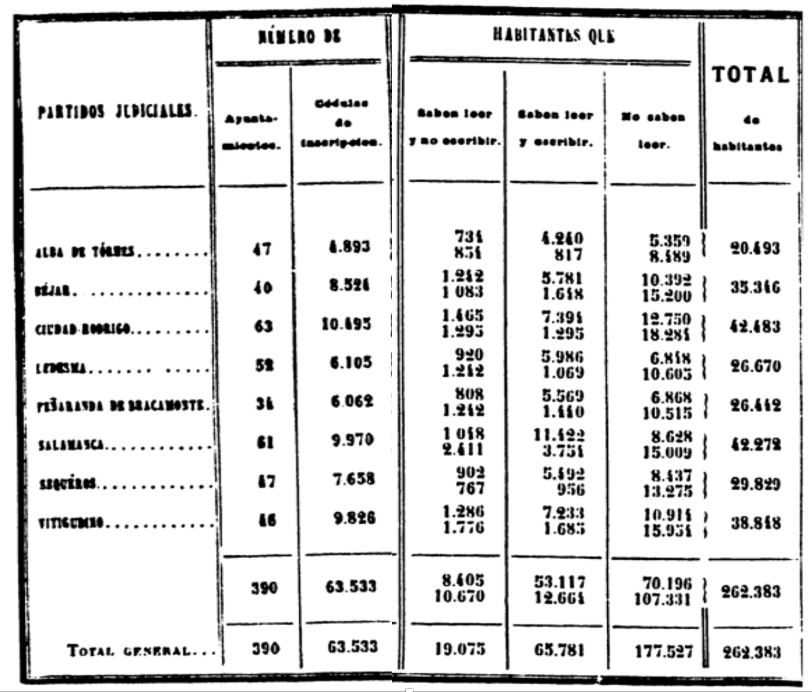

This practice session is based on the summaries of the **Spanish 1860 Population Census**. This source reports information at the **district level** for the whole of Spain and is especially suited to study the educational levels of the population. As well as the name of each administrative unit (*district*) and the *province* it belonged to, the data set contains the number of males and females living in those districts who were illiterate (*illit_m* and *illit_f*), able to read (*read_m* and *read_f*) and able to write (*write_m* and *write_f*). You can find the data [here](data-assign/educ-1860/dist-1860.csv) [@beltran2018] (the Canary Islands are not included).

::: {.column-margin}
{width=100% height=100%} 

Sample image of the Statistical report based on the 1860 Spanish Census and male literacy rates by *partido judicial* (district). Source: [INE Historia](https://www.ine.es/inebaseweb/treeNavigation.do?tn=192209).
:::

::: {.column-margin} 
```{r}
#| echo: false
#| warning: false
#| message: false
library(tidyverse)
library(sf)
library(tmap)
read_sf("data/mapping/dist-1860/dist_1860.shp") |>
  tm_shape() + tm_polygons(fill = "literacy_m",
                           fill.legend = tm_legend(
                           title = "Male literacy (%)"))
```

Male literacy rates by *partido judicial* (district), 1860.
:::

- Download the data set into a folder of your choice and read it into R. Remember to set the working directory and load the necessary packages. Note also that this is a .csv file, so you will need the function `read_csv()`, which is part of the `tidyverse`.

- Explore how the data set looks like. How many observations does it contain? What each observations refers to (unit of analysis)? What kind of information does it report about each observation?

- Compute literacy rates, that is, the percentage of the population who were able to read and write, for both males and females for each district. What are the minimum and maximum values of literacy? Identify the districts that perform best and worst in terms of literacy. 

- What is the average literacy rate?

- Construct a histogram showing the full distribution of both male and female literacy rates.

- Compute average male literacy rates at the province level. Do the same but weighting this measure by the existing male population. Which province ranked highest and lowest in terms of male literacy.


# Solution 

In my case, I downloaded the associated file, `dist-1860.csv`, in the folder `data-assing`, so after setting the working directory in the course folder, the code below imports it into the R environment. As mentioned above, the raw data is in a .csv file, so we use `read_csv()` to read it into R. Note that this function is already loaded when you load the `tidyverse`, so no further packages are needed (at least for now). 

```{r}
#| message: false
#| warning: false
rm(list=ls())
setwd("~/Library/CloudStorage/OneDrive-NTNU/course-websites/computational-history")
library(tidyverse)
data <- read_csv("data-assign/educ-1860/dist-1860.csv")
```

Let's explore how the data set looks like.

```{r}
data
```

As indicated at the top of the R output, this data frame contains 464 rows and 8 columns. This means that we have 8 pieces of information about the 464 districts existing in Spain in 1860 (these districts are administrative units similar to counties). We therefore have 464 observations and the associated information about them in terms of the province they belong to and the number of males and females that are illiterate, able to read and able to both read and write. 

Let's now **compute literacy rates**, that is, the percentage of the population who were able to read and write, for both males and females for each district. The source itself gives us the number of individuals of each sex in each group. For instance, for males, we have *illit_m*, *read_m* and *write_m*. Summing up the three groups would give us the total male population. We can therefore rely on this information to compute literacy rates. We can create new columns using *mutate()* and indicate how to calculate them. We do it below first for males and then for female:

```{r}
data <- data |> 
  mutate(pop_m = illit_m+read_m+write_m,
         lit_m = 100*write_m/pop_m,
         pop_f = illit_f+read_f+write_f,
         lit_f = 100*write_f/pop_f)
```

Running the previous command does not yield any results because we are using the symbol `<-` to modify the existing object `data`. You could now use `view(data)` and scroll to the right to see the new columns that we have created. Alternatively, we are asking R to show one of them to us (*lit_m*), as well as the variables we use to calculation (at least the first 10 cases).

```{r}
data |> 
  select(district, illit_m, read_m, write_m, pop_m, lit_m)
```

We now know what the literacy rate in each district was. What about the average literacy? And the minimum and maximum values? As you will have probably guessed, we will need the functions `summarize()` plus the particular one depending on what we want to compute: `sum()`, `mean()`, `sd()`, `min()`, `max()`, etc. Let's start with the **minimum** and **maximum** values

```{r}
data |> 
  summarize(min = min(lit_m, na.rm = TRUE),
            max = max(lit_m, na.rm = TRUE))
```

The minimum and the maximum values indicate that there are two districts performing specially bad and especially well in terms of literacy: while in one, only 8 per cent of males are able to read and write, in another one more than 64 per cent of them are literate. You could easily identify the name of these districts by using `filter()`.^[Alternatively, you could use `arrange()` and sort in ascending or descending order in terms of *lit_m*.]

```{r}
data |>
  filter(lit_m<8.1)

data |>
  filter(lit_m>64)
```

Let's now compute the average literacy rate for all districts (464 in total). We are going to compute both the **mean** and the **weighted mean**. The first one considers all districts equally, so it adds up their literacy rates and divides that value for the number of observations. This yiels an average literacy of 30.3 per cent. The second one weights each observation according to another dimension. Here we are using population, meaning that the literacy rate of larger districts will weight more when making the computations.^[Note that the function `weighted.mean()` requires two arguments. The first one, `lit_m`, is the field we want to compute the average from. The second one, `pop_m`, defines the weights: here the size of each district in terms of the number of males.] The weighted mean is now 31.3, a bit higher than before. This is because bigger districts (i.e. Madrid, Barcelona, etc.) tend to have higher literacy rates, so given them a bit more weight implies obtaining a slightly higher mean literacy.

```{r}
data |> 
  summarize(mean = mean(lit_m, na.rm = TRUE),
            w_mean = weighted.mean(lit_m, pop_m, na.rm = TRUE))
```

We now have a sense of the average literacy, as well as the minimum and the maximum values. Let's construct a **histogram** to see the full distribution of values. We are going to do it for both male and female literacy rates and then put the two histograms together using the package `patchwork` (you have to install it first if you haven't done so before). Given that the range of values that the two variables (*lit_m* and *lit_f*) cover is quite different (female literacy is significantly lower everywhere), we are forcing the two graphs to show the same range of values in the x-axis, so the comparison is more homogenous.^[Drop that option if you want to see the difference.]

```{r}
hist_m <- data |>
  ggplot(aes(x = lit_m)) + 
  geom_histogram(binwidth = 1) +
  coord_cartesian(xlim = c(0, 70)) +
  scale_x_continuous("Male literacy (%)", breaks = seq(0, 70, 10))

hist_f <- data |>
  ggplot(aes(x = lit_f)) + 
  geom_histogram(binwidth = 1) +
  coord_cartesian(xlim = c(0, 70)) +
  scale_x_continuous("Female literacy (%)", breaks = seq(0, 70, 10))

# install.packages("patchwork")
library(patchwork)
hist_m + hist_f
```

Histograms depict how many observations (districts here) fall within different parts of the distribution of potential values.^[I chose `binwidth = 1` but it is ok if you have chosen a different value and the bars are wider (not defining this option implies that R decides for you). Feel free to try other values and choose the plot that, in your judgement, is more informative without being too noisy (spiky).] A significant number of districts exhibit low male literacy rates (<20-25 per cent). There are however many districts showing higher values and a non-negligible fraction have literacy rates over 50 per cent. By contrast, most districts have very low female literacy rates (<10 per cent). Only a few (three) have literacy rates over 30 per cent. These two plots help having a sense of what literacy rates looked like for males and females in mid-19^th^-century Spain. 

Lastly, imagine that, instead of districts, you are interested in knowing what the province literacy rates are. Recall that one of the columns (*province*) in the data indicates to which province each district belongs to. This enables introducing a super useful command that we will employ quite often during the course: `group_by()`, which allows making computations separately within groups delimited by the categories included in this other variable. The code below *groups* district by province and then computes the average literacy for each group.^[We could have computed the weighted mean (by population) if we wanted to take into account that, within each province, some districts are bigger than others, so they are *weighted* more in the calculations.]

```{r}
data |>
  group_by(province) |>
  summarise(lit_m = mean(lit_m, na.rm = TRUE),
            lit_f = mean(lit_f, na.rm = TRUE))
```

Note that the resulting dataframe no longer have 464 rows (districts) but 48, which is the number of Spanish provinces (excluding the Canary Islands).

This is just one way of looking into the topics presented above. There are different ways of extracting information from the source. You need to find your own in the sense of feeling comfortable with what you are doing and confident about understanding what the different commands are doing and the results themselves. Feel free to play around with the code. For instance, you can remove options to see what they do.
