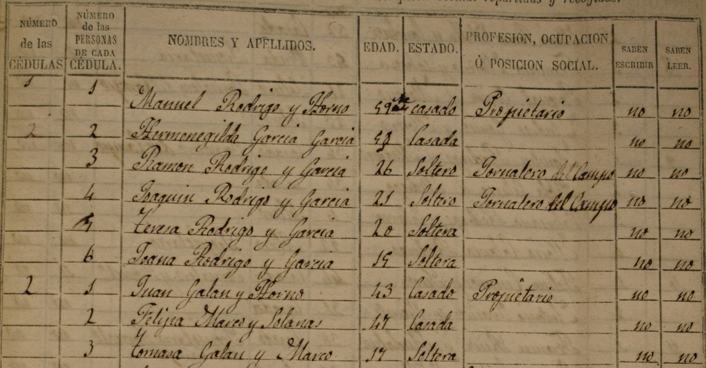

```{r}
#| echo: false
#| results: false
rm(list=ls())
library(tidyverse)
data <- read_csv("data-assign/zgz-1860/sample-zgz-1860.csv")
```

**Case-study 4: Comparing dimensions**

We will rely on census data for the province of Zaragoza (Spain) in 1860. The data set we will work with contains the individual records for all the population living in the 70 municipalities within 40 kilometers from the capital city of Zaragoza (see map below). You can download the data <a href="data-assign/zgz-1860/sample-zgz-1860.csv" download>here</a> [@beltran2024].

::: {.column-margin}  
{width=100% height=100%} 
:::

::: {.column-margin}
```{r}
#| echo: false
#| fig-width: 6
#| fig-height: 6
#| fig-retina: 2
#| out-width: 100%
#| fig-align: center
library(sf)
library(tmap)

pop <- data |>
  group_by(settlement) |>
  summarise(pop = n())

settlements <- read_sf("data-assign/zgz-1860/gis/sample_40.shp") |>
  right_join(pop, by = join_by(settlement)) 

spain <- read_sf("data-assign/zgz-1860/gis/spain.shp")
zgz <- read_sf("data-assign/zgz-1860/gis/zgz_prov.shp")
zgz_cap <- read_sf("data-assign/zgz-1860/gis/zgz_cap.shp") |>
  mutate(settlement = if_else(settlement=="ZARAGOZA", "Zaragoza", "Zaragoza"))
rivers_main <- read_sf("data/mapping/rivers/A3_main.shp")
rivers_sec <- read_sf("data/mapping/rivers/A3_secondary.shp")

m1 <- tm_shape(spain) + tm_borders("grey90") +
  tm_shape(zgz) + tm_borders("grey70") +
  tm_shape(settlements) + tm_dots(size = 0.005)

m2 <- tm_shape(settlements) +
    tm_bubbles(fill = "blue", fill_alpha = 0.5, col = "blue", 
               size = "pop",
               size.scale = tm_scale_continuous(
                 ticks = c(250, 500, 1000, 5000, 10000, 20000, 50000, 100000),
                 values.scale = 2),
               size.legend = tm_legend(title = "Population",
                                       frame = FALSE)) +
  tm_shape(zgz) + tm_polygons(fill_alpha = 0) +
  tm_shape(zgz_cap) + 
    tm_text(text = "settlement",
            size = 0.8, xmod = -1, ymod = -1.2) +
  tm_shape(rivers_main) + tm_lines(col = "blue", lwd = 1) +
  tm_shape(rivers_sec) + tm_lines(col = "blue", lwd = .6) +
  tmap_options(legend.text.fontfamily = "Times")

library(grid)
m2
print(m1, vp = grid::viewport(0.15, 0.19, width = 0.25, height = 0.25))
```

Distribution of the population in the locations studied here.
:::

In total, this data set contains information on 132,500 individuals: name and surname, place of residence, sex, age, marital status, household size, occupation, and so on. Note also that there is a field identifying each family and also who in that family is the father and the mother.

**Extract the information** requested below and **interpret your results**. Present your analysis as a **PDF file** using **Quarto** and submit it via Blackboard before **February 17**. 

1. Explore how the data set looks like. How many observations does it contain? What is the unit of analysis? What kind of information does it report about each observation? Get familiar with the data set by using `count()` or its visual equivalents: `ggplot()` plus `geom_bar()` for qualitative dimensions or `geom_histogram()` for numerical variables. For instance, report how many men and women lived in this area in 1860 and visualise the number of individuals by age. Have a close look at the latter plot: what can you infer from this visualisation about the historical population living in the area under study? 

2. Imagine that we are interested in learning more about the educational level of the population. What fraction of the population is able to read and write? This information is contained in the variable *write* which has two categories: "NO" and "SI" (yes). Distinguish also by *sex* and socio-economic status. The latter is reported in the field *ses* (socio-economic status) which classifies each individual into wide occupational categories (their own or that of their parents or closer family members). Use a bar (or column) plot to display these differences. 
3. Let's continue examining literacy rates but let's now examine (1) how the literacy rate changed over time, and (2) how literacy rates evolved as children grew older (up to 14 years old). Notice that the source also reports whether children were attending school (*school*) or not but the coverage of this information is less consistent. Explore also this variable.

4. Would you characterize this region as rural? How large is the biggest city and the smallest? What is the average settlement size? What about median size? Can you display the distribution of locations by size? Coming back to our original question about education, are there differences in literacy rates between rural and urban areas?

5. The first question asked about the number of individuals reporting different ages. The phenomenon of *age-heaping* refers to the tendency of some individuals to round their ages due to their inability to remember their exact age or to *count* properly.^[Age-heaping can also arise from *digit preference*, that is, the preference for specific numbers in particular cultures.] Which age-groups tend to age-heap more? Are these individuals also less likely to be literate (able to read and write)?^[Tip: to identify those individuals who age-heap, you can rely on the operator `%%`, which returns the remainder after division. Imagine, for instance, two individuals aged 37 and 40. Dividing their ages by 10 yields $3 \cdot 10 + 7$ and $4 \cdot 10 + 0$, respectively. By returning the remainder, the operator `%%` provides the last digit of their age (7 and 0 in this example).]

<!--
5. What is the most common name in our case study? List the 10 most common names for both men and women. Have naming practices changed over time? You can, for instance, check whether these names the same in the early 1800s and in the 1850s or whether the percentage of people bearing the most common names changed over time.

8. Focusing only on children aged 6-10, explore whether names can provide information about the cultural attitudes of the parents and the importance they attached to educating their children. The way you can extract information from names is quite varied. For instance, you can identify those individuals bearing very common names (or you can compute a continuous measure: what is the fraction of the population bearing that name). Alternatively, you can identify those names that signal particular attitudes, such as religious or political names (i.e. after saints, biblical figures, kings or other political or religious symbols). Likewise, if you focus on children, you can also identify who is named after their parents (note that we have fields identifying the family and who is the father and the mother). You can learn more about these issues and about how to present this type of analysis by checking the two first sections (pages 1-10) in the article [What was in a name? Culture, naming practices and education in the past](https://fjbeltrantapia.github.io/papers/names-education-2024.pdf) (especially pages 1-10).
-->

<!--
----

# Solution

This is the third assignment for HIST2025. Here, we are going to explore the information contained in the household registers from the 1860 Population Census of the province of Zaragoza (Spain). Just let me stress that the proposed solution below is only one way of addressing the questions above. You could have approached them differently.

As always you need to open a new script and set the necessary steps to clear the environment, load the necessary packages and import the data.^[Although not visible, the code chuck below includes the option `#| message: false` at the top, so the message that shows up when loading the `tidyverse` is not printed here.] Note that Quarto documents do not need to set the working directory: it is automatically defined to the same folder the .qmd file is located (the root folder). I have the  file, named `sample-zgz-1860.csv`, in the folder `data-assign/zgz-1860`, so the code below reads it into R.^[The function `read_csv()` forms part of the tidyverse, so it becomes available when you load the `tidyverse`.] If you have placed the file with the data set in the same folder as the quarto file, the following will work just fine: `read_csv("sample-zgz-1860.csv")`.

```{r}
#| message: false
rm(list=ls())
library(tidyverse)
data <- read_csv("data-assign/zgz-1860/sample-zgz-1860.csv")
```

The symbol `<-` (called assignment operator) takes the object that `read_csv()` imports and stores it in the environment with the name you indicate (`data` in this case). You can then type the name of the object and have a sense of how the data looks like and how it is structured:

```{r}
data
```

This corresponds to what we were expecting. We can then start considering the questions above.  

The data frame above already tells us that this dataset contains 132,500 observations (individuals). This is the unit of analysis, what we are studying.^[Notice that if we aggregate this information into households or municipalities, the unit of analysis would be different.] The top of the data frame also tells us that we there are 25 columns, that is, pieces of information about these individuals. The results above only give us a peak into the 10 first rows (individuals) and the variables that fit into the computer screen. Feel free to type `view(data)` to explore the full object at ease. You can also use `print(n)` to get info on more rows. `glimpse()` is also a super useful function because it gives the names of all the variables and a peak on their content: 

```{r}
data |> glimpse()
```

`glimpse()` provides the name of the columns, their type (qualitative, \<chr\>, or numerical, \<dbl\>, here) and the values for each category of the first observations. The latter comes in handy because we can see the type of information they contain. The variable *marst*, for instance, gives values such as "Single" or "Married", which helps figuring out that *marst* captures *marital status*. 

----

Let's now respond be more concrete and report what was requested in the first point above. The number of men and women can be retrieved by using `count()` and the name of the variable we are interested in. If you don't use `filter()` to narrow down the analysis, you will get the total number of males and females, regardless of age. Given that we are asking for men and women, we can be a bit more precise and restrict the analysis to those over 18 years (or whatever you think is appropriate). 

```{r}
data |> 
  filter(age>=18) |>
  count(sex)
```

Given that *sex* is a qualitative variable, you could present this information visually using `ggplot()` and `geom_bar()`. Given that now want to visualise the number of individuals by *age*, which is a numerical variable, we can construct a histogram.^[It is also possible to construct a bar graph using `geom_col()` but you need to first count the number of individuals in each category (either *age* or a variable that groups the observations into different age-groups.]. Notice that, the same way that `geom_bar()`, `geom_histogram()` only requires defining which variable is going to be in the x-axis: the function will automatically count how many observations (rows) belong to each group. The argument `binwidth` sets up how wide these intervals will be. Here we set it to 1 to get the distribution of ages for every year of age.^[Setting it to 5 would group individuals into 5-year age-groups.]

```{r}
#| warning: false 
data |>
  ggplot(aes(x = age)) +
  geom_histogram(binwidth = 1)
```

This graph is superinterestig in many ways. The first column reflects the number of individuals in the first age category, 0 here. We can see how the next columns are shorter, meaning that there are a decreasing number of children aged 1, 2, 3 and so on. This is expected since, given the high infant and chil mortality rates these societies suffered, many children did not survive to their next birthday. It is strange though that at around age 10 or so the number of individuals start increasing instead of continuing declining. Why this might be? One potential explanation is migration. The area covered here includes the capital city of Zaragoza and its surrounding (the villages withing 40 kilometers). The capital city especially attracted workers, so that increase in the number of individuals probably reflects the inflow of migrants into the city.[Running the analysis excluding the city of Zaragoza could give more insights into this issue.] 

The other interesting feature of the graph above in the extremely high bars that show up for individuals adults. Why are there many more individuals in particular age-groups? What is going on here? Let's explore this more in detail by having a closer look at adults aged 25-45:

```{r}
data |>
  filter(age>=25 & age<=45) |>
  ggplot(aes(x = age)) +
  geom_histogram(binwidth = 1) +
  scale_x_continuous(breaks = seq(25, 45, 1))
```

There are way more observations aged 30 and 40 than the surrounding ages. Is it possible that mortality shocks (epidemics, famines, wars) affected those age 28 or 33 more than those aged 30? Possible but unlikely. The explanation here is what is knows as **age-heaping**: the tendency of those reporting their age to the census takers to disproportionately report ages ending particular digits, which creates artificial peaks in the age distribution. Age-heaping usually implies rounding ages, so reporting ages ending in 0 (or sometimes 5), due to lower literacy/numeracy or memory problems in old age. As mentioned above, age-heaping can also arise from *digit preference*, that is, the preference for specific numbers ("lucky numbers") in particular cultures. The graphs above seems to suggest a preference for ages ending in 0 or even numbers (multiples of 2) but the latter phenomenon requires further investigation. Age-heaping was a common phenomenon in historical data (and developing countries today) and can be used to study numeracy or educational levels. We will come back to this later.

----

Let's now move on to the second question above: learning more about literacy rates in mid-19th-century Spain. We can start by reporting the number of people who were able to read and write, information stored in the field *write*, simply using `count()` and then computing the percentage based on that number and the total number of observations. The latter can be retrieved using the function `sum()` and indicating to sum the values in the field *n* (which has in turn been computed using `count()`. We then round the resulting value up to 1 decimal place.^[We could also do it directly in the same command line by nesting it: `perc = round(100*n/sum(n), 1)`.]

```{r}
data |>
  count(write) |>
  mutate(perc = 100*n/sum(n)) |>
  mutate(perc = round(perc, 1))
```

The results show that 24.1 per cent of the population was able to read and write.^[Doing the same with the variable *read* would compute the numbers of those who were able to read but not write.] Notice that a small number of observations do not record information on literacy. They comprise a tiny fraction of the full data, so their presence won't affect the results of the analysis.^[When the number of missing values is high, it is however important to explore why they might be missing. Imagine that those who do not report literacy did so because they were illiterate. The *true* literacy rate would be lower that the one we woul be computing with the available information.] We are now going to compute literacy rates for males and females separately. We could do it using `count()` but we can also explore how to do it creating a dummy variable that assigns the values 1 or 0 depending on whether the variable *write* equals "SI" (yes) or not. We do that and store the results by over-writing the object `data`. It is always advisable to check what we have done. To do so, we select the columns containing the info we are interested in (we add also *name* and *sex* to provide a bit of context).

```{r}
data <- data |>
  filter(!is.na(sex)) |>
  mutate(d_write = if_else(write=="SI", 1, 0)) 

data |>
  select(name, sex, write, d_write)
```

It seems the dummy variable *d_write* does what we wanted. We then have 0s and 1s to denote "No" and "Yes". Computing the average literacy by sex therefore implies computing the mean of this variable, using `group_by()` to do it for each sex separately.

```{r}
data |>
  group_by(sex) |>
  summarise(lit_rate = 100*mean(d_write, na.rm = TRUE))
```

Literacy rates are low in general but the situation was especially dire for women: most women were illiterate (only 12.7 per cent were able to read and write). The previous analysis applies to all the population, which also includes children. It would perhaps more adequate to focus on a more homogeneous group, such as the adult population or a particular age-group. Feel free to do it yourself using `filter()`. 

Let's now explore how these values may differ by socio-economic status. The variable *ses* relies on the occupation held by the head of the family and classifies each individual according to this information into groups (you can use `count()` to explore this field on your own). To make things easier, we are just going to focus on adult males and compute their literacy rates by *ses*:^[Alternatively, you could do it simultaneously for mean and women by grouping by two fields: `group_by(sex, ses)`. See also next example.]

```{r}
data |>
  filter(sex=="Male" & age>=16) |>
  group_by(ses) |>
  summarise(lit_rate = 100*mean(d_write, na.rm = TRUE))
```

The results clearly show how class shaped educational achievements: while more than 75 per cent of individuals in the upper socio-economic strata (i.e. elites, merchants) were able to read and write, only 14.5 per cent of those classified as labourers did (this category includes those who did not have access to land or other property and therefore had to sell their work for a living). The other occupational categories sit in between these two. The literacy gap is huge, which speaks volumes of the social inequalities existing in this historical context. Note that here we are considering all adult males, regardless of age. You could explore how these results would change if you narrow the analysis to particular age-groups. Here, we are now going to do it for children aged 6-10, compute it separately for boys and girls and plot the results. The coding is a bit more involved mainly to make the graph looks better: if we re-order the categories in *ses*, so they are depicted from highest to lowest literacy rate. The socio-economic disparities are also clear here. Girls from the lowest backgrounds were especially disadvantaged in terms of literacy.

```{r}
data |>
  filter(age>=6 & age<=10) |>
  group_by(sex, ses) |>
  summarise(lit_rate = 100*mean(d_write, na.rm = TRUE)) |>
  mutate(ses = fct_reorder( # <1>
    ses,
    lit_rate)) |> 
  ggplot(aes(x = ses, y = lit_rate, fill = sex)) +
  geom_col(position = "dodge2") +
  coord_flip() +  
  labs(x = "Socio-economic status", y = "Literacy rate")
```

1. The function `fct_reorder()` re-orders the categories in *ses* according to the values computed in *lit_rate*. Note that we are also reporting results by sex, so the ordering happens within the first category in *sex*, which is "Female". Ordering by "Male" literacy rates would bit a little bit more coding.

----

We now have a better idea of how literacy rates looked like in mid-19^th^-century Spain. Let's now see whether literacy rates were improving or not. We don't have several censuses conducted a different periods to compare literacy rates but we have the *age* of these individuals. We can actually easily infer their year of birth by substracting it from the census year (1860). This procedure is not perfect for assessing change over time because of selection bias.^[Those who are older may constitute a more selected group of individuals due to survival or out-migration (were those individuals surviving and not migrating different from those who died or left?). Also, older people have more time to become literate, an issue that may also bias the analysis.] Implementing this exercise will however give us useful information: better than doing nothing providing we are cautious when interpreting the results. The code below first creates a field with the estimated birth year and then computes the average literacy rates of all individuals born each year (distinguishing also by sex).^[Note how having `geom_point()` and `geom_line()` in the same `ggplot()` command depicts both the dots and the lines connecting them. The last two lines of code edit how the axes look like.] 

```{r}
data |>
  mutate(birth_year = 1860-age) |>
  group_by(birth_year, sex) |>
  summarise(lit_rate = 100*mean(d_write, na.rm = TRUE)) |>
  ggplot(aes(x = birth_year, y = lit_rate, col = sex)) +
  geom_point() +
  geom_line() +
  scale_x_continuous("Year of birth", breaks = seq(1760, 1860, 10)) +
  scale_y_continuous("Literacy rate", breaks = seq(0, 100, 10))
```

The results are very interesting: literacy rates appear to show some improvements in some periods followed by stagnation (or even decline) in others. This may reflect the circumstances that plagued the late 18^th^ century and the first half of the 19^th^ century (economic crises, wars, revolutions, etc.). We should nonetheless be aware of the limitations mentioned above. Migrants, on average, tend to be more literate than those who stayed behind, so these trends might be contaminated by that.^[Note that while the capital city tended to receive migrants, the villages around tend to send them. Running the analysis separately for urban / rural areas might therefore be very informative.] Notice also the spikes in the earlier periods. This is mostly noise because we have very few observations who are very old, so the fact that they are literate or not changes year-to-year due to chance. 

The graph can nonetheless be improved. On the one hand, we can exclude the observations in the earliest periods because we have very few (i.e. before 1785) and those from the 1850s (or even a bit ealier) because they are still children and did not have enough time to become literate (the comparison is therefore unfair). On the other hand, we can overlap a smoothing trend using `geom_smooth()` to better grasp the underlying long-term trends.^[In `geom_smooth()`, the argument `span` controls the amount of smoothing: while larger values produce smoother lines, lower values produce wigglier ones (try changing the parameter yourself). Likewise, we set `se = FALSE` to hide the confidence intervals, something we have not covered.] Something like this helps capturing the underlying trends more clearly:

```{r}
data |>
  mutate(birth_year = 1860-age) |>
  filter(birth_year>=1785 & birth_year<=1845) |>
  group_by(birth_year, sex) |>
  summarise(lit_rate = 100*mean(d_write, na.rm = TRUE)) |>
  ggplot(aes(x = birth_year, y = lit_rate, col = sex)) +
  geom_point() +
  geom_line() +
  geom_smooth(span = 0.25, se = FALSE) +
  scale_x_continuous("Year of birth", breaks = seq(1785, 1845, 5)) +
  scale_y_continuous("Literacy rate", breaks = seq(0, 100, 10))
```

It seems that male literacy declined significantly during the end of the 18^th^ century and increased sharply in the first decade of the 19^th^ century. These were turbulent years, so it is unclear whether these patterns reflect changes in literacy or other factors that selectively affected the population (i.e. famines and wars, and associated migratory flows, etc.). While he period 1805-1830 witnessed relative stagnation or even decline, literacy rates seemed to increase slightly in the 1830s and early 1840s. 

If we come back to the previous graph extending up to 1860, it showed literacy rates declining significantly from 1845 onwards until reaching 0 in 1860. This basically reflects the fact that those born in those years are children and therefore have not started or concluded their education. To better see how literacy rates change as boys and girls grew up we now plot literacy by age and restrict the analysis to those aged 4-14: 

```{r}
data |>
  filter(age>=4 & age<=14) |>
  group_by(age, sex) |>
  summarise(lit_rate = 100*mean(d_write, na.rm = TRUE)) |>
  ggplot(aes(x = age, y = lit_rate, col = sex)) +
  geom_point() +
  geom_line() +
  scale_x_continuous("Age", breaks = seq(4, 14, 1)) +
  scale_y_continuous("Literacy", breaks = seq(0, 45, 5)) +
  theme_minimal()
```

The results illustrate how the learning process is faster for boys. By age 10, however, very few extra boys and girls got literate. This may reflect the time when they dropped out of school due to their working responsibilities in the field or at home. The disparities between boys and girls are probably explained by the different value that parents (and society in general) put into educating their sons and daughters. The curriculum at school itself reflected these values: while boys were expected to learn to read and write, arithmetic and other subjects (i.e. geography and history), girls were only expected to learn how to read (so they could read the Bible) and devoted a lot of time to learn houseskills (i.e. sewing, embroidery, etc.). Female schoolteachers were also significantly less educated than their male counterparts. Exploring what shaped the fraction of children attending school helps shedding more light on these issues. This information is contained in the variable *school*, which is a dummy variable with the value 1 or 0 depending whether the child was attending school or not. The code below computes the percentage of boys and girls aged 6-10 that were attending school.

```{r}
data |> 
  filter(age<=6 & age<=10) |>
  group_by(sex) |>
  count(school) |>
  mutate(perc = 100*n/sum(n))
```

The schooling enrolment that arises from this source is really low. The problem with this variable though is that this information was contained in the field *occ* (occupation) but was not reported systematically. There are locations that, from other sources, we know had a school (and children attending it) but the census does not report any children (or very few) doing so. This obviously infra-estimates the real schooling enrolment rate. A potential solution would be to identify those locations which recorded this information consistently (that is, checking whether the numbers arising from the census are similar to those reported from other sources) and restrict the analysis only to those municipalities. It is possible though that the locations that recorded schooling systematically are different from those who did not, so the results from analysing this sample may not be representative of all the locations in the full original sample. You could however test whether these two groups of villages are similar based on other features (i.e. size, occupational structure, literacy rates, etc.). If they are, you could argue that the results from analysing that subsample are representative of the whole area. We are not following this path here but you can check the [article]((https://fjbeltrantapia.github.io/papers/names-education-2024.pdf)) referenced above to learn more about this procedure and the actual enrolment rates (pages 9-10).

----

Let's now explore whether we should characterize this region as rural in terms of the size of those settlements (range, average, median). The map above already suggests that this region is dominated by a medium-size city (at least by mid-19th-century standards) which is surrounded by small villages. We can be more precise by just counting the number of observations living in each municipality (*munic*) or settlement (*settlement*):^[A municipality could include several dispersed settlements. Most of the population lived concentrated in one location but the population in some municipalities lived in a few dispersed settlements. In total, there are 70 municipalities containing 78 settlements.]

```{r}
data |>
  count(settlement, sort = TRUE)
```

The largest location, Zaragoza, has almost 70,000 inhabitants. The other ones are however quite small. The following computes the mean and median size, as well as the smallest and the largest settlement (we already know the latter figure).

```{r}
data |>
  group_by(settlement) |>
  summarise(pop = n()) |>
  summarise(mean = mean(pop, na.rm = TRUE),
            median = median(pop, na.rm = TRUE),
            min = min(pop, na.rm = TRUE),
            max = max(pop, na.rm = TRUE))
```

It is noteworthy how the mean is much higher than the median. This is because this distribution is quite skewed: most location are relatively small but Zaragoza, the capital city, is way bigger. The average reflects this extreme value. The median, however, is not affected by this type of outlier since it splits the distribution into two and takes the value of the observation that sits in the middle (regardless the values at the top or the bottom). We can have a sense of the full distribution by plotting a histogram or a kernel density graph. Given how different the city of Zaragoza is from the rest of locations, the following creates two histogram: one with all the locations and another one excluding Zaragoza. We are using the package `patchwork` to depict these two plots side by side. Note that adjusting the `bin` argument changes the way the plots look like (there is no perfect solution here but it is up to the researcher to balance between precision and noise).

```{r}
p1 <- data |>
  group_by(settlement) |>
  summarise(pop = n()) |>
  ggplot(aes(x = pop)) +
  geom_histogram(bin = 50)

p2 <- data |>
  group_by(settlement) |>
  summarise(pop = n()) |>
  filter(pop<20000) |>
  ggplot(aes(x = pop)) +
  geom_histogram(bin = 50)

library(patchwork)
p1 + p2
```

The graphs above show that most locations are pretty small (below 500 or 1,000 inhabitants). Some of them are even smaller but we also have a few that are somewhat bigger (a few rought between 2,000 and 5,000 inhabitants). The outlier is the capital city with almost 70,000 people living there.

Coming back to our original question about education, how do we assess whether there were differences in literacy rates between rural and urban areas? There are different ways of doing this. One possibility is to compute both population size and literacy rates for each settlement. We can do this for all the population or distinguishing by sex. Let's do the latter, so it enables a more refined analysis. As you can see, the code below computes the number of men and women living in each municipality plus their literacy rate, which is basically the average of the dummy variable *d_write*.^[An alternative would have been to compute the number of literate individuals, so we could divide that number by the total population to obtain the literacy rate. Note that the function `n()` counts the number of rows, that is, the number of individuals (in each group in this case).] We store the results in a new object called `munic` and check that the results are what we expect.

```{r}
munic <- data |>
  group_by(settlement, sex) |> 
  summarise(pop = n(),
            lit = 100*mean(d_write, na.rm = TRUE))
munic
```

Next step is to show how literacy rates vary by population. We have the male and female population. We could use one of them as a measure of size but to be more precise we can actually create a new variable summing up those two values, so we have the total population of both sexes. Notice that doing this involves using the function `group_by()` but relying on `mutate()` instead of `summarise()`.^ [While `summarise()` aggregates transforms the data frame and therefore changes the unit of observation, `mutate()` makes the computations without changing the structure of the data frame, so the unit of observation remains the same.] As shown below, this procedure creates a new column that sums up the values in a particular column (*pop* here) within each category for the variable in `group_by()`(*settlement* here).

```{r}
munic <- munic |>
  group_by(settlement) |>
  mutate(tot_pop = sum(pop))
munic
```

We are now in the position of comparing rural and urban locations. There are many ways of framing this. We can for instance compare literacy rates in the city of Zaragoza against all the other locations. Let's go a little beyond that a classify each locations according to different sizes, so we can compute literacy rates for different groups. Within `mutate()` we use `case_when()` here but we could have also used `cut()`.^[Using the following: `mutate(size = cut(pop, breaks = c(0, 250, 1000, 5000, Inf)))`.]

```{r}
munic |>
  mutate(size = case_when(
      pop < 250 ~ "Very small (<250)",
      pop < 1000 ~ "Small (250-1,000)",
      pop < 5000 ~ "Medium (1,000-5,000)",
      pop >= 5000 ~ "Large (>5,000)")) |>
  group_by(size) |>
  summarise(lit = mean(lit, na.rm = TRUE))
```

Zaragoza, the only location above 5,000 inhabitants, enjoyed significantly higher literacy rates. The differences between the other locations are much smaller but it seems that the smallest villages suffered an additional penalty.^[Note though that we did not distinguish by sex above. Including *sex* in the *group_by()* function would make the trick and provide and more granular result.]

Another way of looking into this is to plot all available information using a **scatter plot**. This involves taking the object `munic` containing the information on population and literacy and defines those two fields as those depicted in the x- and y- axes. Indicating also to represent the different categories in the field sex with different colours (`col = sex`) allows depicting male and female literacy rates simultaneously. Given that the capital is so much bigger than the rest, having it in the visualisation prevents having a better sense of the variation in the other locations. I am therefore creating two graphs, including and excluding the capital city, to account for this.^[As indicated above, the package `patchwork` allows plotting the two objects (or more) together. Note that, in the first plot, we have removed the title of the legend and situated it within the graph. Given that having the same legend in the second might be redundant and take up space, we have removed it altogether.] 

```{r}
g1 <- munic |>
  ggplot(aes(x = pop, y = lit, col = sex)) +
  geom_point() +
  labs(col = NULL) + 
  theme(legend.position = c(0.6, 0.8)) 

g2 <- munic |>
  filter(settlement!="ZARAGOZA") |>
  ggplot(aes(x = pop, y = lit, col = sex)) +
  geom_point() +
  theme(legend.position = "none")

g1 + g2
```

It is clear that the city of Zaragoza enjoyed higher literacy rates for both males and females. It also seems larger villages also tend to have higher literacy than smaller ones but this is less clear from the graph above.^[We don't cover it here but we could be much more precise about this if we measured the correlation between these two variables: population and literacy.] 

We should also bear in mind that rural and urban locations may differ in their socio-economic structures, so literacy rates may not only reflect a "rural" dimension but the fact that these locations are different in terms of the relative number of children and elderly population, the type of occupations, and so on. We could try to narrow down the analysis to compare more homogeneous groups and therefore shed more light on the "rural" factor. We therefore replicate the above but focusing only on a relatively homogeneous group: individuals aged 16-50 classified as belonging to the "Farmer" socio-economic status (we could obviously try to narrow this down even further but this suffices as an illustration). Instead of a table, the results are now presented as a bar plot.^[Note that we compute the total population before filtering. Otherwise, the number of observations in each location will be much smaller: it would be just those aged 16-50 and classified as "Farmer"].

```{r}
data |>
  group_by(settlement) |>
  mutate(pop = n()) |>
  mutate(size = case_when(
      pop < 250 ~ "Very small (<250)",
      pop < 1000 ~ "Small (250-1,000)",
      pop < 5000 ~ "Medium (1,000-5,000)",
      pop >= 5000 ~ "Large (>5,000)")) |>
  filter(age>=16 & age<=50 & ses=="Farmer") |>  
  group_by(size, sex) |>
  summarise(lit = mean(d_write, na.rm = TRUE)) |>
  mutate(size = reorder(size, desc(lit))) |>
  ggplot(aes(x = size, y = lit, fill = sex)) +
  geom_col(position = "dodge2") +
  coord_flip() + 
  labs(x = "Settlement size", y = "Literacy rate")
```
 
The results show that, even when we focus on a relatively homogenous group (individuals aged 16-50 classified as belonging to the "Farmer" socio-economic group), the disparities in literacy rates persist. However, they are not as striking for men as for women. Rural areas appear to be specially detrimental to female education.

----

The last exercise comes back to the pattern observed above regarding the distribution of ages in the population. The number of people reporting ages ending in 0 and even numbers (0, 2, 4, 6, 8) seemed higher than it should be expected. In order to be more accurate, we can test this more explicitly and classify individuals into groups depending on the last digit of their (reported) age. We can take advantage of the operator `%%`, which returns the remainder after division, to compute the last digit.^[For instance, $37/10 = 3 \cdot 10 + 7$, $23/10 = 2 \cdot 10 + 3$ and $30/10 = 3 \cdot 10 + 0$.] The code below classifies each individuals into the last digit of their age and check what we have done:

```{r}
data <- data |>
  mutate(age_last = age %% 10)

data |>
  select(age, age_last)
```

Theoretically, we should expect the distribution of ending digits to be relatively balanced: around 10 per cent of the population should report an age ending in each digit. We can now check whether this is the case and, otherwise, which digit(s) is the most common one. Instead of reporting a table, we plot the percentage of the population in each group (adding a dashed red line at 10 per cent to act as reference benchmark). The choice of the population under study using `filter()` is important: consider full decade cohorts, so all the digits are equally present, and make sure that particular cohorts are not naturally larger.^[The number of younger individuals tends to be larger than older ones because those who die are no longer present. There will be more 16-year old than 17-year old. These differences can bias the results because the digit 6 will tend to be more prevalent not due to age-heaping but due to being more 16-year old. Feel free to plot a histogram with the distribution of ages to see this more clearly.] We choose to focus on the two decades going from aged 23 to 42.

```{r}
data |> filter(age>=23 & age<=42) |>
  count(age_last) |> mutate(perc = 100*n/sum(n)) |>
  ggplot(aes(x = age_last, y = perc)) + geom_col(alpha = 0.6) +
  scale_x_continuous("Age last digit", breaks = seq(0, 9, 1)) + 
  scale_y_continuous("Population (%)", limits = c(0, 20), breaks = seq(0, 20, 5)) +
  geom_hline(yintercept = 10, col = "red", linetype = "dashed")
```

It is clear that reporting ages ending in 0 (i.e. 30, 40, etc.) is much more prevalent than any other digit. Surprisingly, rounding in 5 is not that common. The other digits that are relatively frequent are 3, 4 and 6, which is quite unexpected and may reflect some kind of "lucky numbers". Let's focus on those reporting an age ending in 0 and create a dummy variable identifying them. We can the explore whether age-heaping differs by sex and increases with age (given that we cannot explore each age separately, we will need to group individuals into decade cohorts). The graph above shows that age-heaping increases with age, a trend that is more pronounced in women: roughly around 35 per cent of women over 56 were reporting age ending in 0.^[Note that we are only classifying those individuals between 16 and 96. There are very few individuals who are older than that, so their results are quite random. The same also applies to the decade 86-96, so they could also be removed.] 

```{r}
data |>
  filter(!is.na(sex)) |>
  mutate(heap_0 = if_else(age_last==0, 1, 0)) |>
  mutate(age_10 = cut(age, breaks = seq(16, 96, by = 10))) |>   
  filter(!is.na(age_10)) |>
  group_by(age_10, sex) |>
  summarise(heap_0 = mean(heap_0, na.rm = TRUE)) |>
  ggplot(aes(x = age_10, y = heap_0, col = sex, group = sex)) +
  geom_point() + geom_line() +
  geom_hline(yintercept = 0.1, col = "red", linetype = "dashed") +
  scale_y_continuous("Population (fraction)", 
                     limits = c(0.05, 0.4), breaks = seq(0.05, .4, 0.05))
```

Another potential explanation for age-heaping is that less literate people are also less numerate and therefore have more difficulty calculating or remembering their actual age. It is possible to test whether this is actually the case. We replicate part of the code above to classify individuals into groups depending on whether they age-heap (*heap_0*). It is now straightforward to compute the average literacy rate for the individuals in each of those categories using `group_by()` and `summarise()`. We focus on individuals aged 23-42 to have a more homogeneous sample and make the computations for men and women separately.^[Feel free to choose a different age-group but make sure that you at least have 10 age categories, so all last digits (0-9) are possible.] 

```{r}
data |> 
  mutate(heap_0 = if_else(age_last==0, 1, 0)) |>  
  filter(age>=23 & age<=42 & !is.na(sex)) |>
  group_by(heap_0, sex) |>
  summarise(d_write = mean(d_write, na.rm = TRUE))
```

On average, both men and women reporting ages ending in 0 are less likely to be literate. While 35 per cent of men reporting ages ending in 0 are literate, this figure increases to 43.1 per cent to those who report any other age. The difference for women is less pronounced (14.6 vs 16.9 per cent) but we should bear in mind that their literacy rates are much lower in general, so the difference is non-negligible in relative terms. This supports the argument posed above: literacy and numeracy are somewhat related. We could also check whether these result also hold depending on marital status or when we restrict the analysis to rural areas (excluding the capital city), among many other possibilities. All these additional exercises would contribute to portray a richer picture of the topic under study.

Let's finish here but the range of topics that could be explored using this source is quite varied. You could for instance look into fertility (i.e. number of children), marriage patterns (i.e. percentage of men and women married at an early age or those who remained single all their lives), presence of extended family members (i.e. grandparents, etc.), dominant occupations (i.e. agriculture vs manufacturing or services, landowners vs landless labourers), household structure (i.e. who tends to be the head of the household), migratory patterns, numeracy captured by age-heaping, etc.

Let me also stressed that this exercise was intended not only as a way of solidifying what you have learned so far but also to show that, when explored creatively, the sources contain way more information than it looks like at first sight. If you want more examples you can check the article [What was in a name? Culture, naming practices and education in the past](https://fjbeltrantapia.github.io/papers/names-education-2024.pdf). Relying on an extended version of the same dataset we have explored here, this article shows that girls bearing more common names (i.e. *Maria*) had lower literacy rates and argues that first names provide historians with information about the cultural values of the parents bestowing those names. As well as enabling classifying individuals according to their names (after religious figures, after family members, after kings or other political figures, etc.), this approach also allows testing whether those values translated into the way that parents raised their children (i.e. the value they attach to education, etc.) and their subsequent life trajectories (i.e. attending school, being literate, etc.)

-->

<!--
----

What is the most common name in our case study? List the 10 most common names for both men and women. Have naming practices changed over time? You can, for instance, check whether these names the same in the early 1800s and in the 1850s or whether the percentage of people bearing the most common names changed over time.

The name of each individual in the data set is reported in the filed *name*. The code below reports the 10 most common names for males and females separately. As shown above, we create two different plots and depict them side by side using the package `patchwork` (we don't need to load it because we already did above). When constructing individual plots, R automatically adjust the $y$ and $x$ axes to the existing variation. Here we want to compare two plots that are measuring the same thing, so it is advisable to have the same range in both. We therefore use `expand_limits()` to expand the $y$-axis artificially to `y = 14`, which (roughly) corresponds to the percentage of women sharing the most common name. This allows making the contrast between the two distributions (male and female) clearer, especially the widespread use of the name *Maria*.  

```{r}
p1 <- data |> 
  filter(sex=="Male" & !is.na(name)) |>
  count(name, sort = TRUE) |> 
  mutate(perc = 100*n/sum(n)) |>
  slice_head(n = 10) |>             # selecting to show only top 10 words
  mutate(name = reorder(name, -desc(n))) |> # ensuring descending order
  ggplot(mapping = aes(x = name, y = perc)) + 
    geom_col(width = 0.7, col = "blue", fill = "blue", alpha = .5) + 
    ggtitle("Males") + xlab("") +
    expand_limits(y = 14) +
    scale_y_continuous("Relative frequency (%)", 
                       breaks = seq(0, 14, by = 2)) +
    theme(axis.text.y = element_text(size = 7),
          plot.title = element_text(hjust = 0.5)) +
    coord_flip() + theme_minimal()

p2 <- data |> 
  filter(sex=="Female" & !is.na(name)) |>
  count(name, sort = TRUE) |>
  mutate(perc = 100*n/sum(n)) |>
  slice_head(n = 10) |>         # selecting to show only top 25 words
  mutate(name = reorder(name, -desc(n))) |> # ensuring descending order
  ggplot(mapping = aes(x = name, y = perc)) + 
    geom_col(width = 0.7, col = "blue", fill = "blue", alpha = .5) + 
    ggtitle("Females") + xlab("") +
    expand_limits(y = 14) +
    scale_y_continuous("Relative frequency (%)", 
                       breaks = seq(0, 14, by = 2)) +
    theme(axis.text.y = element_text(size = 7),
          plot.title = element_text(hjust = 0.5)) +
    coord_flip() + theme_minimal()

p1 + p2
```

In order to compare whether naming practices have changed over time we could compare the list of most common names in two periods (i.e. born in the 1800s and the 1850s). Alternatively, we can compute the percentage of the population sharing the most common 5 or 10 names in different periods. This can be understood as a measure of tradition: parents sticking to the common norm. 

```{r}
data |> 
  filter(!is.na(name) & age<=70) |>
  mutate(birth_year = 1860-age) |>
  group_by(sex, birth_year) |>
  count(name, sort = TRUE) |> 
  mutate(perc = 100*n/sum(n)) |>
  slice_head(n = 10) |>
  summarise(total = sum(perc)) |>
  ggplot(aes(x = birth_year, y = total, col = sex)) +
  geom_point() + geom_smooth(se = FALSE) +
  scale_y_continuous("Perc. sharing the most common names", breaks = seq(30, 65, by = 5)) +
  scale_x_continuous("Year of birth", breaks = seq(1790, 1860, by = 10)) 
```

The results show that the importance of sticking to tradition, in terms of naming practices, have changed over time. In the late 18^th^- and early 19^th^-century, more than 50 per cent of the population shared the 10 most common names. This percentage declined over time to reach around 35 per cent of the population by 1860. The percentage is always higher for males, suggesting that tradition played a slightly more important role when naming boys than girls.

4. Focusing only on children aged 6-10, explore whether names can provide information about the cultural attitudes of the parents and the importance they attached to educating their children. The way you can extract information from names is quite varied. For instance, you can identify those individuals bearing very common names (or you can compute a continuous measure: what is the fraction of the population bearing that name). Alternatively, you can identify those names that signal particular attitudes, such as religious or political names (i.e. after saints, biblical figures, kings or other political or religious symbols). Likewise, if you focus on children, you can also identify who is named after their parents (note that we have fields identifying the family and who is the father and the mother).

Following with our previous example, we can classify children depending on whether they bear a common name or not and then compute their respective literacy rates.^[Alternatively you can assign to each children, the fraction (or the percentage) bearing the same name.] Given how different Zaragoza is from the rest of the sample, we can also run the analysis separately for these two subsamples. We first create two objects with the most common names for boys and girls, bind them together and create an additional column identifying them as a dummy variable would (0/1)

```{r}
boys <- data |> 
  filter(!is.na(name) & age>=6 & age<=10 & sex=="Male") |>
  count(name, sort = TRUE) |>
  slice_head(n = 10)
girls <- data |> 
  filter(!is.na(name) & age>=6 & age<=10 & sex=="Female") |>
  count(name, sort = TRUE) |>
  slice_head(n = 10) 
common <- bind_rows(boys, girls) |> 
  mutate(common = 1) |>
  select(name, common)
```

We can now take the original data set with all the children aged 6-10 and identify which one are bearing the most common names by matching them to this object using the column *name*, which is present in both objects `data` and `common`, as the matching field. The code below does that and checks the results by selecting only the fields *name* and *common*.

```{r}
data |> 
  filter(!is.na(name) & age>=6 & age<=10) |>
  full_join(common, by = "name") |>
  select(name, common)
```

As you can see above, we have 10,886 rows, that is, children aged 6-10. Their names are classified as `1` in the column *common* if they corresponded to the names we stored in the object `common`. When they do not, they are assigned the value `NA`, meaning that the "join" did not find a corresponding match. The results are what we were looking for: the most common names, such as "MARIANO" or "MANUELA" have been assigned a "1". We can therefore continue with the analysis. To have a proper dummy variable, the other children not bearing a common name should be classified as "0" before computing the corresponding literacy rates. We therefore recycle part of the code above:

```{r}
children <- data |> 
  filter(!is.na(name) & age>=6 & age<=10) |>
  full_join(common, by = "name") |>
  mutate(group = if_else(is.na(common), "No", "Yes")) 

children |> select(name, common, group)
```

We can now create two plots comparing the ability to read and write of children depending on whether they bear common names or not for those living in urban and rural areas.

```{r}
urban <- children |>
  filter(settlement=="ZARAGOZA") |>
  group_by(group, sex) |>
  summarise(lit = mean(d_write, na.rm = TRUE)) |>
  ggplot(aes(x = group, y = lit, fill = sex)) +
  geom_col(position = "dodge2") +
  labs(x = "Common name", y = "Literacy rate") +
  ggtitle("Zaragoza city") 

rural <- children |>
  filter(settlement!="ZARAGOZA") |>
  group_by(group, sex) |>
  summarise(lit = mean(d_write, na.rm = TRUE)) |>
  ggplot(aes(x = group, y = lit, fill = sex)) +
  geom_col(position = "dodge2") +
  labs(x = "Common name", y = "Literacy rate") +
  ggtitle("Villages") 

urban + rural
```

The results show that bearing a common name is related to lower literacy rates, especially in urban areas and specially for girls. These results are however tentative and may be influenced by other factors, such as birth order, social class, and so on, so the analysis should be more nuanced.

Another factor that might be influencing the results is the fact that having a common name may reflect two different things. These names were common because families were sticking to shared norms. Religion was an important factor and many families chose religious names (i.e. Mary). Naming after family members was also very common and this tendency reinforces the importance of particular names because they are transmitted across generations. Having a common name may therefore reflect different things about the importance that the family may have attached to education depending whether the name is common because it is religious or because it is a family name. It is very difficult to identify religious names in Catholic countries because the Church prescribed that all names should be religious (after saints). We can however identify which children were named after their parents using the info in *fam_id*, *father* and *mother*. While the former is a family id, the other two identify who in that family is the father and the mother (if any; they could be dead or absent). 

The code below creates two objects with the names of the parents (mother and father) in each family.

```{r}
fathers <- data |>
  filter(father==1) |>
  select(fam_id, name) |>
  rename(fath_name = name)

mothers <- data |>
  filter(mother==1) |>
  select(fam_id, name) |>
  rename(moth_name = name)

fathers
```

As you can see from the checking the results above, we have an object with the family identifies (*fam_id*) and the name of the father (or the mother). We can now join these objects to our original data set or that with the children (and all the info), so we can have that additional column with the parents name. Note that we have changed the name of the field from *name* to *fath_name* (or *moth_name*) to distinguish it from the field *name* itself that is in the original data set. As always, we check our results.

```{r}
children <- children |>
  left_join(fathers, by = "fam_id") |> # <1>
  left_join(mothers, by = "fam_id") 

children |>
  select(name, fath_name, moth_name)
```

1. We employ `left_join()`, instead of `full_join()`, because we are only interested in joining the children with their parents.

As evident above, we now have the child's name together with his/her parents in the same data set (*NA* meaning that the census did not report a father or a mother in that family). We can now create a variable identifying which children are named after their parents.

```{r}
children <- children |> 
  mutate(aft_par = if_else(name==fath_name | name==moth_name, 1, 0)) 

children |>
  count(aft_par)
```

As expected, we could not identify the name of the parents of an important fraction of children because they were not present in the census (either absent or dead). As shown above, some children were named after their parents. Let's break this out by sex (excluding those we could not identify). Interestingly, this naming practice differed quite significantly by sex: while almost 10 per cent of boys were named after their fathers, only 5 per cent of girls bore the names of their mothers (despite the ubiquity of *María*). It seems that parents attached more importance to continue the family name for males than for females.

```{r}
children |>
  filter(!is.na(aft_par)) |>
  group_by(sex) |>
  summarise(aft_par = 100*mean(aft_par, na.rm = TRUE))
```

Let's now revisit our topic here and check whether having a common name and being named after your parents shaped the likelihood of being literate. Remember that we had recoded the info on having a common name in a field called *group*. In order to compare more homogenous groups, we are going to exclude the city of Zaragoza, so as to study only rural areas. We therefore recycle part of the code above.

```{r}
children |>
  filter(settlement!="ZARAGOZA") |>
  filter(!is.na(aft_par)) |> 
  mutate(aft_par = factor(aft_par)) |> # <1>
  group_by(group, aft_par, sex) |>
  summarise(lit = mean(d_write, na.rm = TRUE)) |>
  ggplot(aes(x = group, y = lit, fill = aft_par)) +
  geom_col(position = "dodge2") +
  facet_wrap(~ sex) +
  labs(x = "Common name", y = "Literacy rate")
```

1. The variable *aft_par* (0/1) needs to be transformed into a factor variable. Otherwise it is considered a numerical continuous variable (check what happens if you remove this step).

The results show that this variable in quite important and its effects also differ by sex. Being named after the father is associated with higher literacy rates for boys and especially so in those who were not carrying a common name. Girls' literacy rates were very low in general but those who were named after their mothers suffered even lower literacy rates. Again, these results are tentative and may be affected for other factors. The elites, for instance, tended to bestow less common names and also had higher literacy rates. The link we see here can therefore be affected by this. Let's therefore replicate this exercise but focusing on particular segments of the population (i.e. farmers, labourers, etc.). As shown below, the same results still hold for boys (although the scale is different). Which other variables should we perhaps take into account?

```{r}
children |>
  filter(settlement!="ZARAGOZA") |>
  filter(ses=="Farmer" | ses=="Labourer") |>
  filter(!is.na(aft_par)) |> 
  mutate(aft_par = factor(aft_par)) |> # <1>
  group_by(group, aft_par, sex) |>
  summarise(lit = mean(d_write, na.rm = TRUE)) |>
  ggplot(aes(x = group, y = lit, fill = aft_par)) +
  geom_col(position = "dodge2") +
  facet_wrap(~ sex) +
  labs(x = "Common name", y = "Literacy rate")
```

-->

