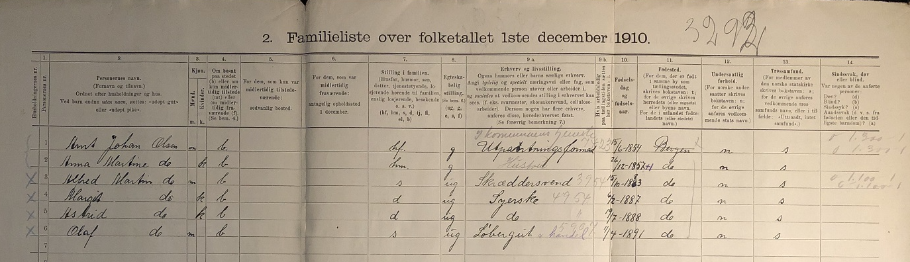
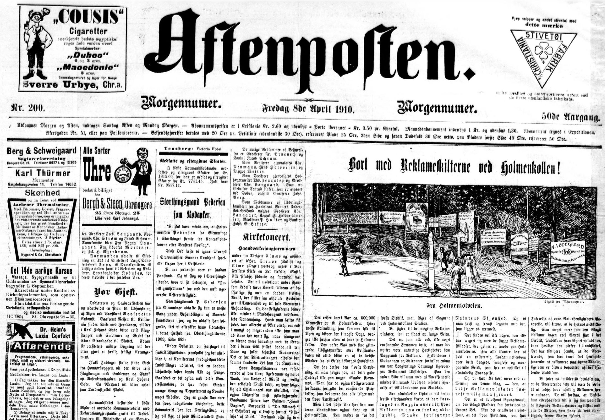

**Case-study 6: Mapping**

This assignment explores both the 1910 Norwegian census and the newspapers published in Norway during that year. The aim is to be able to map the information contained in those sources. In the process, we will also practice the crucial skill of "cleaning" data, that is, making it ready for subsequent analyses.

### Question 1

Census are a crucial source of information about the demographic and socio-economic characteristics of the society performing the enumeration. The image below provides a sample of the 1910 Norwegian census. Organised by households, it includes name and surname, sex, age, place of birth and residence, marital status, occupation and religion, among other information. Many other details can also be inferred, such as the position in the household or the number (and type) of people residing in each household. You can, for instance, count how many children were residing with the family. This information has been digitised in full by the [Norwegian Historical Data Center](https://rhd.uit.no) hosted at UiT. You can find the a curated version of this data set in Blackboard. Given that it is stored as a .txt file, you will need to import it into R using the function `read_delim()` and specifying the following argument `delim = "\t"`. In total in contains information on the almost 2.5 million people living in Norway at that time.

{width=100% height=100% fig-align="center"}

This exercise requires mapping the variation in early marriage in 1910 using municipalities as the unit of analysis. A way to look into early marriage using the census is to compute the percentage of the population aged 16-20 who was married (or widowed). Note that most variables are formated as "string" even when they are numerical, so they need to be formated properly first using `as.numeric()`. The shapefile containing the Norwegian municipalities at that time can be found in Blackboard.

### Question 2

The other source we will be using is the newspapers published in Norway in 1910. The [National Biblioteket](https://www.nb.no/search?mediatype=aviser) has gathered thousands of these records. Instead of searching online, we will use the R package [dhlabR](https://github.com/NationalLibraryOfNorway/dhlabR) to directly interact with the corpus. If you have trouble downloading this packages (due to its dependencies), you can use the .csv file with the corpus of newspapers that is in Blackboard. 

{width=100% height=100% fig-align="center"} 

Here, you will map the number of newspapers published in Norway in 1910 according to their place of publication. The corpus of newspapers can be retrieved using the `dhlabR` package. As well as this source, you will need a spatial object to be able to do the mapping. You can either use an already existing shapefile containing Norwegian locations or use the `geocoder` package to extract the geographic coordinates that are needed to create such a (point) shapefile.

<!--
----

# Solution

```{r}
#| echo: false
rm(list=ls())
```

Let's start by importing the data set and exploring how it looks like (as well as clearing the environment and loading the `tidyverse` package). Quarto documents do not need to set the working directory: it is automatically defined to the same folder the .qmd file is located (the root folder). Given that the file is named `census-1910.txt` and is in my folder `data/census-1910`, the code below reads it into R. This is a text file and most fields are recorded as string variables encoded with UTF-8 and using tab as the separator. We are therefore using `read_delim()`, part of the tidyverse, to import this file, including the argument `delim = "\t"` to indicate that each field is separated by a tab.^[Defining the `locale` helps making sure the characters are properly encoded and recognised.] Typing the name of the newly created object `census` allows inspecting its contents but you can also use `glimpse()` to check how all fields look like.

```{r}
library(tidyverse)
census <- read_delim("data/census-1910/census-1910.txt",
                     delim = "\t",
                     locale = locale(encoding = "UTF-8"))
census
```

As you can see, the first three columns help situating each observation: municipality of residence, followed by the household number and the individual number within that household. It then includes personal information (name, surname, sex and civil status), followed by occupation and other information such as birtdate (separated in three columns: day, month and year of birth) and place of birth, nationality and religion. Note that many of these fields record numbers (instead of the actual value). This is because this information has been encoded to homogenise it and facilitate its use. You can find what these numbers mean in the file named "codebook.pdf".

We are interested in age at marriage. Although there is no field recording age, the variable *faar* reports year of birth. It is always advisable to inspect the data, so there are no surprises. Given that *faar* is formated as a character field (string), it needs to be transformed into numerical if we want to take advantage of its numerical properties. 

```{r}
census <- census |> 
  mutate(faar = as.numeric(faar))

census |> 
  ggplot(aes(x = faar)) + geom_histogram(binwidth = 5)
```

As you can see below, there are a bunch of observations whose year of birth is 0. As the codebook makes clear, this is a code for not having information (a missing value). If you check, they comprise 10,194 rows (observations). We could convert it into NA or just restrict the analysis excluding those observations using `filter(faar!=0)`. However, if we plot *faar* again, the graph looks weird because it extends before 1700 and beyond 2000. 

```{r}
census |> 
  filter(faar!=0) |>
  ggplot(aes(x = faar)) + geom_histogram(binwidth = 1)
```

Although we don't see columns there, they are there but they are minuscule because they refer to very few observations (whose numbers are negligible compared to the scale of the graph, in hundreds of thousands of observations). If you explored the data using `filter()`. you will see that there are observations with implausible birth years. In historical data sets, dirty data is all around. If we could, we would check the source and correct their values (if possible). Here we adopt a more lazy (call it practical) approach and simply disregard them. Given that the census is conducted in 1910, we only consider those with years of birth between 1800 and 1910.^[If you check, this involves disregarding only 79 observations, which is a minimal fraction of the full population.] Replicating the histogram above yields something more informative.^[Note that the amount of age-heaping is much smaller than what we observed in assignment 3. Norway in 1910 was a more numerically-skilled population than rural Spain in 1860.]

```{r}
census <- census |> 
  filter(faar!=0) |>
  filter(faar>=1800 & faar<=1910) 
census |>
  ggplot(aes(x = faar)) + geom_histogram(binwidth = 1)
```

This looks ok. Given that are interested in age of marriage, we can now derive their ages based their birth year and on knowing that the census was conducted in 1910.

```{r}
census <- census |>
  mutate(age = 1910-faar)
census |>
  ggplot(aes(x = age)) + geom_histogram(binwidth = 1)  
```

The information on who is married or not, marital status, is contained in the field *sivilstatus*. As shown below, this field contains five different categories:

```{r}
census |>
  count(sivilstatus)
```

We therefore need to compute a dummy variable classifying the individuals as married (1) or not (0) using `if_else()` or `case_when()`. Being separated or a widow also implies having been married, so they should be classified accordingly. Note also that the category "ukjent" is better if codified as missing (NA), so we do not treat them as not married.

```{r}
census <- census |> 
  mutate(married = case_when(
    sivilstatus %in% c("gift", "skilt", "enke") ~ 1,
    sivilstatus=="ugift" ~ 0,
    sivilstatus=="ukjent" ~ NA_integer_))
census |>
  count(married)
```

Let's now compute the percentage of the population age 16-20 who were already married. We restrict the analysis to that age-group and the calculate the average (the mean) of the variable *married*. Given that this is a variable that can be 0 or 1 at the individual level, the average of all those 0s and 1s in the fraction of the population classified as 1. If we want the percentage, we just multiply time 100.

```{r}
census |>
  filter(age>=16 & age<=20) |>
  summarise(married = 100*mean(married, na.rm = TRUE)) 
```

So 2.12 per cent of the Norwegian population aged 16-20 was married in 1910. This number however could be different in different regions or municipalities. Remember that the field *kommunern* classified each individual into the municipality they were residing. The variable *fsted* provides the municipality of birth. Instead of the actual names, this information is encoded into municipal codes. If you inspeac one of these fields, you will see all those codes. In total, there were 659 municipalities.

```{r}
census |>
  count(kommunenr) 
```

Computing the percentage of the population who were married in each of these locations just involve replicating the code above but adding the `group_by()`, so the computations take place for each group (municipality here) separately. We store the results in a separate object.

```{r}
married_kom <- census |>
  filter(age>=16 & age<=20) |>
  group_by(kommunenr) |>
  summarise(married = 100*mean(married, na.rm = TRUE))   
married_kom
```

In the municipality with code "0101", 1.4 per cent of the population aged 16-20 was married. The other rows provide the same information for the remaining municipalities (up to 659). 

This is the information we want to map. In order to do so, we need a spatial object with the municipal boundaries in 1910. We have that shapefile in the course materials ("kommuner_1910.shp"),^[As discussed in class, it actually refers to a bunch of files with the same name but different extensions.] so let's now import it using `read_sf()`, which is part of the package `sf`. We use the argument `options = "ENCODING=LATIN1"` to make sure we are able to read the Norwegian characters it contains.

```{r}
library(sf)
kommuner_gis <- read_sf("data/census-1910/kommuner-1910/kommuner_1910.shp",
                        options = "ENCODING=LATIN1")
kommuner_gis
```

This is a curated shapefile that reconstructs the municipal boundaries in 1910. It contains 659 features (polygons) that, conveniently, match the number of municipalities that are also present in the 1910 census. As we can see above, we have columns with municipal and regional codes, as well as the name of the municipality itself. The column *geometry* contains the spatial coordinates necessary to map their contours. Let's check it using the package `tmap`.

```{r}
library(tmap)
kommuner_gis |>
  tm_shape() + tm_polygons(lwd = 0.2, col_alpha = 0.5)
```

Next step is to attach the information on municipal early marriage to this spatial object, so it can be mapped. Both objects have 659 features (rows) each. The fields containing the names of the municipalities are named differently: *KNR* in the GIS file and *kommunenr* in the census.^[The shapefile has actually 3 fields identifying the municipalities: 2 municipal codes (in string and numerical format, respectively) and 1 with their names.] We therefore merge the two objects using `full_join()` and those two fields as matching fields. Always check that the matching is what you expected. Not only the resulting object has the expected number of rows,^[Non-matched features from both objects would also be listed, thus increasing the number of rows.], but the code below shows that all rows have info on the early marriage rate.

```{r}
kommuner_gis <- kommuner_gis |>
  full_join(married_kom, by = c("KNR" = "kommunenr"))

kommuner_gis |> filter(is.na(married))
```

We can now map the information. 

```{r}
kommuner_gis |>
  tm_shape() + 
  tm_polygons(fill = "married", lwd = 0.2, col_alpha = 0.5)
```

In 1910, early marriage was generally low all over Norway. On average, the percentage of the population marrying early was very small (2.1 per cent). However, there is substantial variation across the country. There are a few areas were the number of young people marrying early was higher in some inland municipalities and especially in the north where it could reach up to 14 per cent of the population aged 16-20). The code below lists the municipalities with the highest rates. 

```{r}
kommuner_gis |>
  select(KNAVN, married) |>
  arrange(desc(married))
```

The next step would be to know why these municipalities had such a high rates. As we learnt last week, one possibility is just chance. In small municipalities (with only a few young people), the fact that many of them married could be just a result of chance.^[The same way that the fact that there are municipalities with 0 people getting married before age 20 could also result merely from chance.] It would be therefore interesting to show confidence intervals to see whether those figures are "really" different from the other ones. Another possibility is selection bias. It is plausible that some single individuals had migrated, leaving more married ones, relatively speaking. In this case, what we are observing (higher marriage rates) are not the result of a particular cultural setting but of higher migration rates. Lastly, the observed patterns could reflect different behaviour: cultural values (shaped by tradition, religion, etc.) could influence the way people behaved in these areas and therefore explain their tendency to marry early. 

----

Let's now move on to newspapers and explore the media landscape in Norway in 1910. We retrieve the corpus from the National Biblioteket using the function `get_document_corpus()` (from the package `dhlabR`). I am going to assume that either the digitised collection is complete or, at least, representative of the universe of newspapers published in Norway at that time. It is however part of the historian's toolkit to practice source criticism and assess the potential biases in the existing material.^[Computational and quantitative analyses also help assessing those biases (detecting, for instance, systematic gaps in the source).] 

Indicating 1910 and 1911 as `from_year` and `to_year` will return the newspapers published in 1910.

```{r}
library(dhlabR)
news <- get_document_corpus(
  doctype = "digavis", 
  from_year = 1910, to_year = 1911,
  lang = NULL,
  limit = 50000)
news |> glimpse()
```

The function returns a data set of 42,966 rows, which means that there are this number of texts associated to newspapers published 1910. We now structure the data frame, so we can work with it more easily, and keep only the variables that might be more useful: *dhlabid*, *title*, *year* and *city*. 

```{r}
news <- news |>
  as_tibble() |>
  select(dhlabid, title, year, city) |>
  mutate(dhlabid = map_int(dhlabid, 1),
         title = map_chr(title, 1),
         year = map_int(year, 1),
         city = map_chr(city, 1))
news
```

The corpus has 21,223 newspapers. Feel free to explore the content of the different fields. As we can see, there is missing information in the variable *city*. It might sometimes be possible to infer that information from the *title* but let's proceed as it is. The code below computes the number of newspapers published in each location (*city*) in 1910. There are 54 *known* locations.

```{r}
news_city <- news |>
  group_by(city) |>
  summarise(obs = n())
news_city |> filter(city!="")
```

We now have an object containing a list of locations and the number of newspapers published in each of them in 1910.

In order to map this information, we need a spatial object with municipal boundaries (polygons) or simple points in space (dots). Given the type of information we have, dots might be better because we can visualise importance by increasing the size of the dot.

It would be relatively easy to find a shapefile with Norwegian locations online. This would be a reliable method because we would know that they spatial locations are correct. We could then joint the two pieces of information as we have done above. The names in the matching fields should correspond (unless you perform a fuzzy matching), so some cleaning would be perhaps required.

Instead we are going to obtain the coordinates for those locations using the package `tidygeocoder`. In order to improve the chances that the geocoding tool finds the locations accurately, we are going to provide more information. Here, we are just adding that they are all in Norway but we could also indicate the region they belong to if we had that information.

```{r}
library(tidygeocoder)

news_city <- news_city |> 
  filter(city!="") |>
  mutate(city = str_trim(city),
         city = paste(city, ", Norway", sep = ""))
news_city
```

We are now ready to use `geocode()` to automatically retrieve the spatial coordinates of our list of locations. We are using the `osm` geocoding service and requesting `full_results` makes it easy to double-check what kind of locations we have got (more details in the course materials: mapping.pdf). 
-->
<!-- To make sure I replicate the same results, I saved the results news_city_geo |> 
  select(city, obs, lat, long, place_id) |>
  write_csv("data-assign/newspapers-1910/city-locations.csv")
  so I do not evaluate this
-->

<!--
```{r}
#| eval: false
news_city_geo <- news_city |>
  geocode(city, method = "osm", full_results = TRUE)
```

```{r}
#| echo: false
news_city_geo <- read_csv("data-assign/newspapers-1910/city-locations.csv")
```

The results seem to be ok. We now have two columns, *lat* and *long* with the spatial coordinates we needed. We are going to assume that this is ok but you should check (one way of checking is by mapping them).

```{r}
news_city_geo
```

This is a regular object but it now contains two columns with the xy coordinates (longitude/latitude). We can now transform it into a spatial object using this information and assigning a Coordinate Reference System. Given that the spatial coordinates are obtained from a global repository, we are going to use the WGS84 geographic coordinate system (`EPSG:4326`).^[This GCS is the standard for GPS and uses latitude and longitude in decimal degrees to define locations on Earth's surface. We can always transform the crs to one more appropriate for continental Norway later: e.g. ETRS89 / UTM zone 33N (EPSG:25833).]

```{r}
news_city_geo <- news_city_geo |>
  filter(!is.na(lat)) |>
  st_as_sf(coords = c("long", "lat"), crs = 4326) 
```

We can then map it, indicating that we want the size of the dots to change according to the number of newspapers published in 1910 (column *obs*). As mentioned above, mapping the locations also allow checking whether the map looks ok.^[You could for instance use `tm_text()` to add labels with the city names to the map.]

```{r}
news_city_geo |>
  tm_shape() +
  tm_dots(fill = "red", fill_alpha = 0.5,
          size = "obs",
          size.scale = tm_scale_continuous(
            ticks = c(50, 250, 1000, 2000, 3000, 4000)))
```

This looks quite ok but we need a reference, so the reader can better situate these locations to the Norwegian context. We could use the Norwegian municipalities or get one from the package `geobounds`. We do the latter, so you can learn how to obtain any country (or several) in the world. The function `gb_get_adm0()` returns the national boundaries of the defined country.^[Other functions, such as gb_get_adm1() or gb_get_adm2(), up to 5, provide lower level administrative boundaries (regions, districts, municipalities, etc. depending on the country).] We include the argument `simplified = TRUE`: we sacrifice some precision in how the boundaries are draws, so the file is smaller and therefore easier to handle (this is advisable for Norway given all the fjords). Lastly, we also make sure they are in the same CRS.^[Otherwise, use `st_transform()` to change one of them based on the other.]

```{r}
# install.packages("geobounds")
library(geobounds)
norway <- gb_get_adm0("Norway",
                      simplified = TRUE) 
st_crs(norway)==st_crs(news_city_geo)
```

We can now replicate the map adding the Norwegian boundaries. It is sometimes advisable to have polygons as the first layer and the points as the second one. Feel free also to play with the aesthetics of the map until you find one that satisfies you.

```{r}
tm_shape(norway) + tm_borders(lwd = 0.2) +
  tm_shape(news_city_geo) +
  tm_bubbles(fill = "red", fill_alpha = 0.5,
             col = "red", col_alpha = 0.5,
             size = "obs",
             size.scale = tm_scale_continuous(
               ticks = c(50, 250, 1000, 2000, 3000, 4000)))
```

And that's it. Here you have a map with the intensity of newspaper publications in 1910. Recall that there were many documents that did not have information on the city of publication, so this is not a full picture of this phenomenon. More work could be done trying to assign a location to those newspapers (if possible). In any case, this is quite informative.
-->
