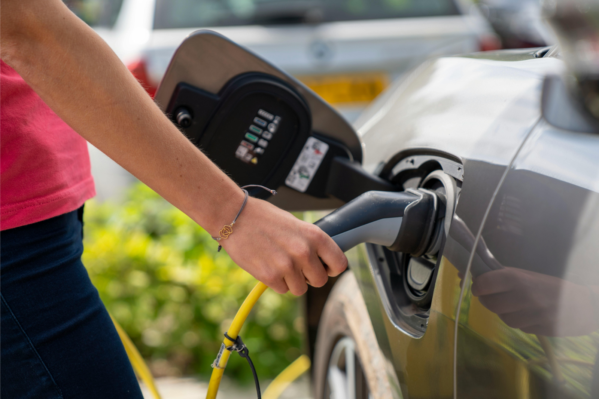

<style>
  .quarto-float-caption {
    text-align: center;
  }
</style>

{width=50% height=50% fig-align="left"}

<!--### Introduction -->

In recent years, the global push towards more sustainable transportation has accelerated, driven by both international climate agreements and ambitious national policies [@europeancomission2019; @jääskeläinen2021]. The European Union has set strict CO2 emission limits for new passenger cars [@europeancomission2019], setting a regulatory framework for its member states. In alignment with these directives, Finland has committed to reducing transport-related emissions by 50% by 2030, with the long-term goal of achieving a fully fossil-free transport system by 2045 [@jääskeläinen2021]. Electric vehicles (hereafter referred to as EVs) are often found as a key solution to these challenges, offering a cleaner alternative to traditional combustion engine vehicles [@europeancomission2019; @jääskeläinen2021; @heiskanen2024].

To accelerate EV adoption, Finland's Ministry of Transport and Communications has set a concrete goal in its Roadmap for Fossil-Free Transport -project: increasing the number of EVs to 750,000 by year 2030. However, the feasibility and social acceptance of EVs are not uniform across the society, which might hinder the possibilities of reaching this goal. Research by Heiskanen et al. on the regional fairness of the electrification of transport points out how socio-economic factors and political orientations can shape perceptions of EV feasibility and accessibility within the national scope [@heiskanen2024]. For this reason, this essay explores how perceived feasibility of switching to an EV varies across political party affiliation and regions in Finland. The analysis is based on the EVA Survey on Finnish Values and Attitudes Autumn 2022 [@EVA], provided by the Finnish Social Science Data Archive. The analysis in this essay is conducted using R and R Studio programs. The aim is to gain a spatial understanding of how political ideology might influence the support or skepticism towards EVs in Finland.

### Data

The survey dataset used in this essay examines Finnish citizens' opinions on a wide range of societal issues, including economic conditions, politics, values, and attitudes towards climate change and related policy measures. The dataset is structured as a cross-sectional survey data, where each observation represents an individual respondent. The dataset includes 229 variables and 2088 respondents in total [@EVA].

```{r}
# Start afresh
rm(list=ls()) 

library(tidyverse)
library(tidytext)
library(modelsummary)
library(sf)
library(tmap)
library(kableExtra)

EVASurvey <- read.csv2("daF3780_eng.csv")
```

We are first interested in the background factors of the respondents, such as age and gender, to get a better understanding of the qualities of the population under study. As it is often the case with this type of data, recoding some of the variables is necessary, such as computing the age of the respondents based on their birth year. It is worth stressing that the variable measuring political party affiliation in the original data springs from the responses to the question "If parliamentary elections were held now, the candidate of which political party would you vote for?" (T13). The original question was modified as followed to exclude the options (10) "Other party or group", (11) "Would not vote", (12) "Can't say" and (13) "Don't want to say", because we are interested only in the parties which the respondents would vote for<!-- to map them-->. These answer options contain no valuable information in this case and have therefore been considered as missing values, which means that these individuals will be dropped from the analysis (516 observations).

```{r}
# creating variable for age based on the birth year of the respondents
EVASurvey <- EVASurvey |>
  mutate(age = 2022 - bv2)

# recoding gender     
EVASurvey <- EVASurvey |>
  mutate(gender = case_when(
    T1 == 1 ~ "Male",
    T1 == 2 ~ "Female",
    T1 == 3 ~ "Other",
    is.na(T1) ~ NA_character_,
    TRUE ~ NA_character_  
  ))

# checking the distribution of gender and missing values
# table(EVASurvey$gender, useNA = "always") 
# SILENCED NOW: IT WAS MORE OF A CHECK

# recoding the political party affiliation, excluding values 10, 11, 12 and 13

# checking the distribution of party affiliation and missing values
# table(EVASurvey$T13, useNA = "always")
  

# adding data labels
EVASurvey <- EVASurvey |>
  mutate(political_party = case_when(
    T13 == 1 ~ "Social Democratic Party (SDP)",
    T13 == 2 ~ "Finns Party (PS)",
    T13 == 3 ~ "National Coalition Party (KOK)",
    T13 == 4 ~ "Centre Party (KESK)",
    T13 == 5 ~ "The Greens (VIHR)",
    T13 == 6 ~ "Left Alliance (VAS)",
    T13 == 7 ~ "Swedish People's Party (RKP)",
    T13 == 8 ~ "Christian Democrats (KD)",
    T13 == 9 ~ "Movement Now (Liike Nyt)",
    T13 == 10 ~ NA_character_,
    T13 == 11 ~ NA_character_,
    T13 == 12 ~ NA_character_,
    T13 == 13 ~ NA_character_,
    TRUE ~ NA_character_
  ))

#checking the distribution of finalized recoding
# table(EVASurvey$political_party, useNA = "always")
  
```

Finally, the perceived feasibility of switching to an EV (hereafter referred to as EV feasibility) is captured using the information on the question: "There has been discussion about climate actions citizens can do to limit global warming. How possible do you think taking the following actions would be in your current situation? Exchanging petrol/diesel car to a fully electric car" (Q10_11). The answer options range from 1-5 on a likert-scale: (1) "Completely possible", (2) "Possible to some extent", (3) "Difficult to say", (4) "Almost impossible" and (5) "Completely impossible". To have a more sensible ranking, I switched the scale, so a higher value indicates that switching to an EV is perceived as more possible: 1 representing "Completely impossible" and 5 representing "Completely possible".

```{r}
# recoding EV feasibility and flipping the scale to be more sensible
EVASurvey <- EVASurvey |>
  mutate(EV_feasibility_numeric = 6 - Q10_11)

# turning it into a factor to keep the desired levels 
EVASurvey <- EVASurvey |>
  mutate(EV_feasibility = factor(
    EV_feasibility_numeric,
    levels = c(1, 2, 3, 4, 5),
    labels = c(
      "Completely impossible",
      "Almost impossible",
      "Difficult to say",
      "Possible to some extent",
      "Completely possible"
    )
  ))

# checking the distribution and missing values -- SILENCED NOW
# table(EVASurvey$EV_feasibility, useNA = "always")

# checking the levels 
# levels(EVASurvey$EV_feasibility)
```

### Electric vehicle feasibility by sex, age and political affiliation

Let's now report some descriptive statistics to have a sense of what our data looks like in terms of age and gender of the respondents, as well as their perceived EV feasibility.

```{r}
#| label: tbl-ev1
#| tbl-cap: "Distribution of age and EV feasibility"

Min  <- function(x) sprintf("%.0f", min(x, na.rm = TRUE))
Max  <- function(x) sprintf("%.0f", max(x, na.rm = TRUE))
Mean <- function(x) sprintf("%.1f", mean(x, na.rm = TRUE))

# table of distribution for age and EV feasibility 
EVASurvey |>
  filter(gender!="Other") |> # to focus only on male/female  
  rename("EV feasibility (numeric)" = EV_feasibility_numeric,
         "Age" = age,
         "Gender" = gender) |>
  datasummary(Gender*Heading("Variable")*(Age + `EV feasibility (numeric)`) ~ 
                N + Min + Max + Mean, data = _)
```

From @tbl-ev1 we can see that we have in total 2088 responses on the perceived EV feasibility question, and 2085 responses on age, so we have three observations missing on age. Regarding age, the minimum age of the respondents is 18, and the maximum 79, thus representing the Finnish population aged 18-79. The distribution of men (n=1,028) and women (n=1,034) is very balanced and both their age profile and their average responses to EV feasibility are very similar.[^1] Regarding the latter, the average is 2.7, slightly below the medium value of 3 in a scale from 1 to 5. Now let's visualize this information to better see if there are differences in the perceived EV feasibility by gender:

[^1]: There are 26 respondents whose sex has been categorized as "other". Given that it is very difficult to extract meaningful patterns from such a small sample, these individuals have been excluded from the analysis.

```{r}
#| label: fig-ev1
#| fig-cap: "EV feasibility by gender"
#| fig-width: 5 
#| fig-height: 3

# visualizing EV feasibility by gender
EVASurvey |>
  filter(gender!="Other") |> # to focus only on male/female
  ggplot(aes(x = EV_feasibility)) +
  geom_bar(stat = "count") +
  coord_flip() +
  facet_wrap(~ gender) +
  labs(y = "Count", x = "EV feasibility") +
  theme_minimal() 
```

@fig-ev1 suggests that there exist moderate gender differences in the perceived feasibility of switching to an EV. Men are more likely to perceive switching to an EV as difficult or even impossible, as indicated by their overrepresentation in the lowest feasibility categories. In contrast, women display a slightly more balanced distribution and are relatively more represented in the moderate feasibility categories. However, the differences are not extreme and both groups show a general tendency towards skepticism. What needs to be noted is that these are descriptive results only, since no statistical testing has been conducted.

Let's now explore whether the mean perceived EV feasibility of men and women change by political party affiliation. @fig-ev2 shows that, among the observed groups, supporters of the Greens report the highest perceived feasibility of switching to an EV. This is followed by the voters of the Swedish People's Party, while voters of the Left Alliance come in third. This pattern suggests that political orientation may be associated with differing attitudes towards technological transitions within transport. In particular, parties that tend to emphasize environmental sustainability and structural societal change appear to correspond with higher perceived feasibility of switching to an EV. The Greens typically prioritize climate policy, emissions reduction and technological transition, and have claimed an interest to invest into the electrification of transport [@politica] which aligns naturally with the high EV feasibility perceptions of their voters. The Left Alliance also tends to support strong public intervention in climate and infrastructure policy, and have also named increasing the share of hybrid and fully electric vehicles to be one of their goals within their official goals of 2020-2023 [@leftall], which may explain relatively high EV feasibility perceptions among their voters. In contrast, the Swedish People's Party is usually considered to be more centrist/liberal, but often focus on pragmatic issues and are generally pro-EU. Additionally, they have officially mentioned renewing the vehicle fleet to support low-emission passenger cars as well as extending the public charging infrastructure to be their aims within their urban policy programme [@rkp2021], which might translate into support for green transition policies even if their voters would not be ideologically driven by environmentalism in the same way as the voters of The Greens or Left Alliance.

```{r}
#| label: fig-ev2
#| fig-cap: "Mean EV feasibility by gender and political party affiliation"
#| fig-width: 6
#| fig-height: 4


# visualizing the mean EV feasibility by gender and political party affiliation
# to see if there are differences
EVASurvey |>
  filter(gender != "Other") |>
  filter(political_party != "NA") |>
  group_by(gender, political_party) |>
  summarise(mean_feas = mean(EV_feasibility_numeric, na.rm = TRUE), 
            .groups = "drop") |>
  mutate(political_party = fct_reorder(political_party, 
                                       mean_feas,
                                       .desc = TRUE)) |>
  ggplot(aes(x = mean_feas, y = political_party, fill = political_party)) +
  geom_col() +
  facet_wrap(~ gender) +
  scale_fill_manual(values = c(
    "The Greens (VIHR)" = "darkgreen",
    "Swedish People's Party (RKP)" = "yellow",
    "Social Democratic Party (SDP)" = "red",
    "National Coalition Party (KOK)" = "blue",
    "Movement Now (Liike Nyt)" = "violet",
    "Left Alliance (VAS)" = "darkred",
    "Finns Party (PS)" = "darkviolet",
    "Christian Democrats (KD)" = "brown",
    "Centre Party (KESK)" = "gray"
  )) +
  labs(x = "Average EV feasibility", y = "Political party") + 
  coord_cartesian(xlim = c(1, 5)) +
  theme_minimal() + 
  theme(legend.position = "none")
```

In contrast, voters of the current governing parties in Finland, the National Coalition Party, the Finns Party, and the Christian Democrats, display comparatively lower perceived feasibility of switching to an EV. This pattern may reflect differences in how these parties frame their green transition and transport policy. For example, the National Coalition Party emphasizes market-based solutions, and name goals such as phasing out the vehicle tax to renew the passenger vehicle fleet, and pricing car usage based on actual emissions, as well as promoting the electricity distribution network in Finland so that the conditions for using low-emission vehicles improve throughout the country. However, they appear to be more technologically neutral and emphasize economic efficiency in their principle programme, supporting climate action but typically avoiding strong state intervention or very technology-specific mandates [@principl]. While this does not imply opposition to electrification of transport, it may translate into more cautious perceptions of EV feasibility among their voters. The Finns Party, however, has expressed more critical views on rapid transport electrification, emphasizing the affordability, regional equality and the potential burden of climate policies on the finnish population. They highlight concerns about the costs of diesel and gas, as well as infrastructure limitations within transportation in their transport policy programme [@liikenne]. Interestingly, the Christian Democrats claim to support climate action and name concrete possible actions such as convertion subsidies for internal combustion engine vehicles, expanding the public charging and biogas network, as well as proposing scrappage incentive programs and a gradual exemption of taxes for lower-emission vehicles. However, they emphasize moderation and social fairness, and the emphasis regarding transport seems to be rail transport in their climate and energy programme [@christiandemocrats2019]. Even though they name multiple goals and a will to support the electrification of the passenger vehicle fleet, their voters seem to express fairly reserved assessments of their own capabilities of switching to an EV.

Taken together, these findings suggest that among the current governing parties, greater skepticism or conditional support toward EV adoption may be linked to concerns about economic costs, equity and the pace of the technological change, in contrast to the more optimistic perceptions visible among the voters of environmentally oriented opposition parties. These observations relate to Heiskanen et al. and their analysis of "just transition" dynamics. In their article, they argue that the perceptions of feasibility and fairness are socially structured, meaning that technological transitions such as the electrification are interpreted differently depending on individuals' broader value systems and structural positions [@heiskanen2024]. The present findings align with their argument by showing that respondents that identify with environmentally oriented or socially progressive parties tend to perceive EV adoption as more feasible.

### Regional variation 

After the observation of our respondents and their party affiliation and it's impact on their perceptions of the feasibility of transferring to an EV, it would be interesting to see this information on a map to showcase the differences between regions. Since Finland is a sparsely populated country, with regional differences within the public charging network, as well as differences in the driving distances to access different day-to-day services [@jääskeläinen2021], the spatial dimensions of these observations become fascinating.

```{r}
##| label: fig-ev3    ALL THIS HAVE BEEN SILENCED NOW (NO LABEL, CAPTION, ETC. NEEDED)
##| fig-cap: "Finnish map with regional borders"  
##| fig-width: 6                                 
##| fig-height: 4

# importing the shapefile data of finnish regions
finland_regions <- st_read("fi_shp/fi.shp", quiet = TRUE)
    

# checking what the shapefile data contains
# finland_regions 

#finland_regions |> 
 # tm_shape() +
 # tm_polygons(fill = "blue", col = "white", lwd = 0.5)

# cleaning the data before merging it with the EVASurvey data

# recoding region of residence
EVASurvey <- EVASurvey |>
  rename(region = T4)

# adding data labels
EVASurvey <- EVASurvey |>
  mutate(region_name = case_when(
    region == 1 ~ "Uusimaa",
    region == 2 ~ "Southwest Finland",
    region == 3 ~ "Satakunta",
    region == 4 ~ "Kanta-Häme",
    region == 5 ~ "Pirkanmaa",
    region == 6 ~ "Päijät-Häme",
    region == 7 ~ "Kymenlaakso",
    region == 8 ~ "South-Karelia",
    region == 9 ~ "South Savo",
    region == 10 ~ "North Savo",
    region == 11 ~ "North Karelia",
    region == 12 ~ "Central Finland",
    region == 13 ~ "South Ostrobothnia",
    region == 14 ~ "Ostrobothnia",
    region == 15 ~ "Central Ostrobothnia",
    region == 16 ~ "North Ostrobothnia",
    region == 17 ~ "Kainuu",
    region == 18 ~ "Lapland",
    TRUE ~ NA_character_
  ))

# modifying the names to match the survey data
finland_regions <- finland_regions |>
  mutate(region_name = case_when(
    name == "Åland" ~ NA_character_,
    name == "Lapland" ~ "Lapland",
    name == "Northern Ostrobothnia" ~ "North Ostrobothnia",
    name == "Kainuu" ~ "Kainuu",
    name == "North Karelia" ~ "North Karelia",
    name == "South Karelia" ~ "South-Karelia",
    name == "Kymenlaakso" ~ "Kymenlaakso",
    name == "Uusimaa" ~ "Uusimaa",
    name == "Finland Proper" ~ "Southwest Finland",
    name == "Satakunta" ~ "Satakunta",
    name == "Ostrobothnia" ~ "Ostrobothnia",
    name == "Central Ostrobothnia" ~ "Central Ostrobothnia",
    name == "Northern Savonia" ~ "North Savo",
    name == "Southern Savonia" ~ "South Savo",
    name == "Central Finland" ~ "Central Finland",
    name == "Southern Ostrobothnia" ~ "South Ostrobothnia",
    name == "Pirkanmaa" ~ "Pirkanmaa",
    name == "Tavastia Proper" ~ "Kanta-Häme",
    name == "Päijät-Häme" ~ "Päijät-Häme",
    TRUE ~ NA_character_
  ))

# checking the recoding
# unique(finland_regions$region, na.rm = TRUE) #  SILENCED

# merging the shapefile data with the survey data
merged_data <- merge(finland_regions, EVASurvey, by = "region_name")
```

<!--Now we have obtained -->

We rely on a map of Finnish regions which is divided according to the NUTS3 classification<!-- (see @fig-ev3). The NUTS classification is -->, a three-level hierarchical regional classification, which is used for statistics submitted to Eurostat, the Statistical Office of the European Union<!--. Statistical data between European countries can be compared by means of the classification."--> [@tilastok]. NUTS3 divides the country into 19 regions. <!--Within--> Note that in this analysis, Åland is excluded, since the EVA Survey dataset does not include data from Åland. <!--The 18 regions under analysis are pictured in @fig-ev4. NOT NEEDED. THE REGIONAL DIVIDE IS CLEAR WHEN YOU PRESENT THE DATA-->Next, let's map the average EV feasibility by the 18 regions in Finland to determine how much spatial variation exists. Let's also look at the number of answers per region regarding the EV feasibility to get an overall picture of how reliable our results are.

```{r}
#| eval: FALSE # SILENCED CHUNK NOW; BETTER DELETE THE WHOLE CHUNK
##| label: fig-ev4
##| fig-cap: "Map of Finnish regions (NUTS3)"
##| fig-width: 6
##| fig-height: 4

# mapping the regions (NUTS3)
colors <- c(   "#E41A1C","#377EB8","#4DAF4A","#984EA3","#FF7F00",
               "#A65628","#F781BF","#999999","#66C2A5","#FAFF62",
               "#8DA0CB","#A78AC3","#CFD854","#FFD92F","#E5C494",
               "#CCCCCC","#1B9E77","#D95F02" )

merged_data |>
  tm_shape() +
  tm_polygons(fill = "region_name", 
              fill.scale = tm_scale_categorical(values = colors),
              col = "white", 
              lwd = 0.5,
              fill.legend = tm_legend(
                title = "Region",
                frame = FALSE)) + 
  tm_layout(panel.labels = c(""),
            panel.label.bg.color = "white",
            panel.label.frame = FALSE,
            frame = FALSE)
```

```{r}
#| label: fig-ev5
#| fig-cap: "Average EV feasibility and number of responses by region"
##| fig-width: 6 # CHANGED, IT WAS TOO BIG (12, 10)
##| fig-height: 5

# creating aggregated data to map EV feasibility by region
aggregated_data_region <- EVASurvey |>
  filter(EV_feasibility_numeric != "NA") |>
  group_by(region_name) |>
  summarise(
    avg_EV_feasibility = mean(EV_feasibility_numeric, na.rm = TRUE),
    count = n()
  )
merged_data_region <- merge(finland_regions, aggregated_data_region, by = "region_name")

# mapping EV feasibility by region
merged_data_region |>
  tm_shape() +
  tm_polygons(fill = "avg_EV_feasibility", 
              fill.scale = tm_scale_intervals(values = "Blues"),
              col = "white", 
              lwd = 0.5, 
              fill.legend = tm_legend(
                title = "Perceived EV feasibility",
                title.size = 1, # SIZE CHANGED (FROM 2) 
                text.size = 1,
                frame = FALSE)) +
  tm_text("count", text.format = "n = {value}", size = 1) + # SIZE CHANGED (FROM 2) 
  tm_layout(panel.label.bg.color = "white",
            panel.label.frame = FALSE,
            frame = FALSE)

```

As can be seen from @fig-ev5, the regional distribution of perceived EV feasibility in Finland follows a spatial pattern, where higher perceived feasibility tends to concentrate in the more urbanized and densely populated southern regions, such as Uusimaa, Pirkanmaa and Southwest Finland, while lower feasibility is more common in northern and peripheral areas, such as Lapland, Kainuu and Ostrobothnia. For the visualization the EV feasibility values were not limited in any way to better capture the differences between different regions. Within the areas with higher perceived feasibility, this pattern may be explained by structural factors, such as a better public charging infrastructure, higher income levels and shorter average travel distances. In contrast, within the regions that reflect lower EV feasibility, the pattern may be a result of longer travel distances, as well as more limited charging infrastructure availability.

However, the variation in sample sizes across regions should be taken into account when interpreting these results. We can see from @fig-ev5, that regions like Uusimaa (n=731), Pirkanmaa (n=262) and Southwest Finland (n=199) have substantially larger numbers of responses compared to regions such as Central Ostrobothnia (n=20) or Kainuu (n=23). This means that the estimates for smaller regions might be less reliable and much more sensitive to individual responses. Despite this, the overall pattern suggests that the perceived EV feasibility in Finland is not geographically evenly distributed. This supports recent research<!--the idea of Heiskanen et al., who--> claiming that transition to electric mobility may reinforce existing regional inequalities unless targeted policies are implemented to improve accessibility in less advantaged areas [@heiskanen2024].

### Political and spatial dimensions of EV feasibility

While the regional differences discussed above showcase the regional variation and might reflect structural conditions, this does not fully explain the variation in attitudes at the individual level. As suggested by @heiskanen2024, perceptions are not only affected by material conditions but also socio-political factors, such as values and political orientation. To build on the spatial analysis, the following section integrates a political dimension by examining how the perceived feasibility of switching to an EV varies across voters of different political parties within regions. Let's now visualize the perceived EV feasibility by political party affiliation to compare the voters of governmental parties as well as the biggest opposition parties.

First we show<!--let's check (TO AVOID REPEATING LET'S CHECK TOO MUCH)--> the amount of answers within each region by the political party to get a sense of the amount of responses:

```{r}
#| label: fig-myplot
#| fig-cap: "Heatmap of responses by region and political party"
#| fig-width: 6
#| fig-height: 4

# grouping the data for a heatmap
heatmap_data <- EVASurvey |>
  filter(political_party != "NA") |>
  group_by(region_name, political_party) |>
  summarise(n = n(), .groups = "drop") |>
  complete(region_name, political_party, fill = list(n = 0))

# plotting a heatmap of counts
ggplot(heatmap_data, aes(x = political_party, y = region_name, fill = n)) +
  geom_tile(color = "white") +
  geom_text(aes(label = n), size = 3) +
  scale_fill_gradient(low = "lightyellow", high = "lightblue") +
  labs(x = "", y = "") + # NOTE THAN I HAVE RENAMED THE LABELS (THEY WERE UNNECESSARY AND TOOK SPACE)
  theme_minimal() +
  theme(axis.text.x = element_text(angle = 45, hjust = 1))
```

@fig-myplot shows the number of survey responses by region and political party. The distribution is uneven, with higher concentrations in Uusimaa and among larger parties, which is not surprising. These differences in sample size should however be considered when interpreting the regional patterns in perceived EV feasibility. To further examine how political orientation interacts with spatial factors, selected political parties representing different positions in perceived EV feasibility are mapped across Finnish regions. Rather than presenting all parties individually, this approach focuses on a subset of parties to illustrate the key contrasts identified previously. The analysis includes the Greens, the Left Alliance, the National Coalition Party and the Finns Party. These parties represent relatively high, moderately high, intermediate and lower perceived EV feasibility among their voters. Additionally, this way two current governmental parties (National Coalition Party and Finns Party) and two opposition parties (The Greens and Left Alliance) are included within the comparison.

```{r}
#| label: fig-map1
#| layout-ncol: 2
#| fig-cap: "Regional EV feasiblity metric by political party affiliation"
#| fig-subcap: 
#|   - "Finns Party"
#|   - "National Coalition Party"
#|   - "Left Alliance"
#|   - "The Greens"
#| fig-width: 6
#| fig-height: 5

# filtering and grouping data
# based on political party, region and EV feasibility
aggregated_data_polparty <- EVASurvey |>
  filter(!is.na(political_party)) |>
  group_by(region_name, political_party) |>
  summarise(
    avg_EV_feasibility = mean(EV_feasibility_numeric, na.rm = TRUE),
    count = n()
  )

# merging data to map voters of political parties and their
# perception of EV feasibility regionally
merged_data_polparty <- merge(finland_regions, 
                              aggregated_data_polparty, 
                              by = "region_name")

# Finns Party (PS)
merged_data_polparty |>
  filter(political_party == "Finns Party (PS)") |>
  tm_shape() +
  tm_polygons(fill = "avg_EV_feasibility", 
              fill.scale = tm_scale_intervals(
                values = "Oranges",
                breaks = c(1,2,3,4,5)),
              col = "white", 
              lwd = 0.5, 
              fill.legend = tm_legend(
                title = "Perceived EV feasibility",
                title.size = 14,
                text.size = 14,
                frame = FALSE)) +
  tm_text("count", text.format = "n = {value}", size = 1) + 
  tm_layout(panel.label.bg.color = "white",
            panel.label.frame = FALSE,
            frame = FALSE)

# National Coalition Party (KOK)
merged_data_polparty |>
  filter(political_party == "National Coalition Party (KOK)") |>
  tm_shape() +
  tm_polygons(fill = "avg_EV_feasibility", 
              fill.scale = tm_scale_intervals(
                values = "Blues",
                breaks = c(1,2,3,4,5)),
              col = "white", 
              lwd = 0.5, 
              fill.legend = tm_legend(
                title = "Perceived EV feasibility",
                title.size = 14,
                text.size = 14,
                frame = FALSE)) +
  tm_text("count", text.format = "n = {value}", size = 1) +
  tm_layout(panel.label.bg.color = "white",
            panel.label.frame = FALSE,
            frame = FALSE)

# Left Alliance (VAS)
merged_data_polparty |>
  filter(political_party == "Left Alliance (VAS)") |>
  tm_shape() +
  tm_polygons(fill = "avg_EV_feasibility", 
              fill.scale = tm_scale_intervals(
                values = "PuRd",
                breaks = c(1,2,3,4,5)),
              col = "white", 
              lwd = 0.5, 
              fill.legend = tm_legend(
                title = "Perceived EV feasibility",
                title.size = 14,
                text.size = 14,
                frame = FALSE)) +
  tm_text("count", text.format = "n = {value}", size = 1) +
  tm_layout(panel.label.bg.color = "white",
            panel.label.frame = FALSE,
            frame = FALSE)

# The Greens (VIHR)
merged_data_polparty |>
  filter(political_party == "The Greens (VIHR)") |>
  tm_shape() +
  tm_polygons(fill = "avg_EV_feasibility", 
              fill.scale = tm_scale_intervals(
                values = "Greens",
                breaks = c(1,2,3,4,5)),
              col = "white", 
              lwd = 0.5, 
              fill.legend = tm_legend(
                title = "Perceived EV feasibility",
                title.size = 14,
                text.size = 14,
                frame = FALSE)) +
  tm_text("count", text.format = "n = {value}", size = 1) +
  tm_layout(panel.label.bg.color = "white",
            panel.label.frame = FALSE,
            frame = FALSE)

```

The previous maps show that relationship between political orientation and perceived EV feasibility is not geographically uniform across Finland. Although party affiliation appears to structure attitudes toward EV adoption nationally, the spatial distribution of these perceptions suggest that regional conditions may either reinforce or moderate these political tendencies.

Among the four selected parties, voters of the Greens display the highest and most geographically consistent perceived EV feasibility. In some regions, the average feasibility values among Green voters reach the highest category range (4.0-5.0), which is not visible among any of the other parties. Even in many northern and less densely populated regions, Green voters continue to report comparatively high feasibility perceptions relative to the other parties. This suggests that support for EV adoption among Green voters is strongly connected to ideological and value-based factors rather than solely to local infrastructural conditions. It seems that environmentally oriented political identity appears to maintain relatively optimistic perceptions even in regions where practical conditions for EV adoption may be less favorable. Voters of the Left Alliance show somewhat similar but slightly more moderate spatial pattern. In southern Finland, especially in urban regions, perceived EV feasibility is generally high, although not as consistently as among voters of The Greens. In northern and eastern regions, the average feasibility scores decline more clearly. This might indicate that while Left Alliance voters are generally supportive of climate-oriented transitions, their perceptions are somewhat more sensitive to regional structural realities, such as travel distances, income levels or infrastructure accessibility.

The National Coalition Party displays a more mixed regional profile. In the southern growth regions, especially Uusimaa, average feasibility levels among their voters are relatively high, but generally remain lower than among The Greens or Left Alliance voters. Outside the major urban areas, the perceived EV feasibility declines more visibly. This might reflect the market-oriented and technologically neutral approach to climate policy discussed earlier. Supporters of the National Coalition Party might view EV adoption positively in regions where infrastructure and economic conditions already support electrification, while remaining more cautious in areas where the transition appears less practical or economically efficient. The Finns Party voters represent the lowest perceived EV feasibility across most Finnish regions. Within all but four regions, the average EV feasibility values fall into the lowerst category (1.0-1.9). Even in southern Finland, where structural conditions are generally more favorable, the feasibility perceptions among Finns Party voters remain clearly below those of the other observed parties. This pattern reflects the party's visibly critical stance towards rapid transport electrification and concerns regarding regional equality, affordability and the uneven consequences of climate policies.

The maps also indicate that regional context seems to matter regardless of party affiliation. Across nearly all parties, the southern and urbanized regions tend to exhibit higher perceived EV feasibility than nothern and sparsely populated areas. This implies that political ideology alone does not determine perceptions of EV adoption, but political attitudes appear to interact with material and spatial conditions, such as charging infrastructure availability, commuting distances and regional accessibility. However, these patterns should be interpreted with caution in regions where the number of observations is low, as indicated by the counts displayed on the maps. This is particularly visible for the Greens in certain northern, eastern and western regions as well as the Left Alliance in certain eastern and western regions containing only one or no observations. In such cases, individual responses have a disproportionate effect on regional averages, and no firm conclusions can be drawn that represents the attitudes of the general population of these areas. The maps should rather be interpreted as indicative patterns rather than precise regional measurements.

### Conclusion

This essay examined how the perceived feasibility of switching to an electric vehicle (EV) varies across political party affiliation and regional context in Finland. Using the "FSD3780 EVA Survey on Finnish Values and Attitudes Autumn 2022" dataset, the analysis combined descriptive statistics with spatial mapping to explore how attitudes towards EV adoption are socially and geographically structured.

The results suggest that both political orientation and regional context seem to shape the perceptions of EV feasibility, although in somewhat different ways. Political party affiliation is associated with clear differences in the overall level of perceived EV feasibility. Voters of environmentally oriented parties, such as The Greens and the Left Alliance report higher EV feasibility perceptions, while voters of parties such as the Finns Party, and to a lesser extent, the National Coalition Party express more cautious or skeptical views. These differences seem to reflect broader ideological positions regarding climate policy, economic priorities and the role of technological transition within the society, At the same time, the spatial analysis demonstrates that perceived EV feasibility is also regionally differentiated. Higher feasibility perceptions are concentrated in southern and more urbanized regions, whereas lower feasibility is more common in northern and peripheral areas. This pattern is visible across nearly all political groups, suggesting that structural factors shape perceptions regardless of political affiliation. However, the political orientation might influence how these structural conditions are interpreted on an individual level. For example, voters of environmentally oriented parties seem to generally maintain more positive feasibility perceptions even in regions where infrastructural conditions may be less favorable, while voters of parties emphasizing economic caution and regional equality tend to express lower feasibility perceptions across most regions.

Overall, the findings reinforce the argument presented by Heiskanen et al. that perceptions of sustainable technological transitions are shaped through an interaction between political values and structural conditions, as well as socially structured and linked to broader questions of fairness and accessibility. [@heiskanen2024]. Support for EV adoption in Finland therefore appears not only politically polarized, but also geographically uneven. These findings suggest that the transition towards electric mobility may develop unevenly across Finland unless regional disparities in infrastructure and accessibility are addressed.

It is important to note, that the analysis within this essay also entails important limitations. The uneven distribution of responses across regions and party groups means that some estimates are based on very small sample sizes, which reduces the reliability of the findings, which is mentioned afore. Additionally, the analysis focuses on perceived EV feasibility rather than actual behavior, and given the way the original questionnaire was formulated, it is not possible to identify respondents who already own an electric car, to whom the question of switching to an electric vehicle might not apply. Furthermore, the data used in this analysis is from year 2022, which may limit the relevance of the findings to the current context. Since then, developments in EV technology, infrastructure, and policy may have influenced public pereptions, meaning that the results reflect attitudes at the time of data collection rather than the present situation.

## Sources
