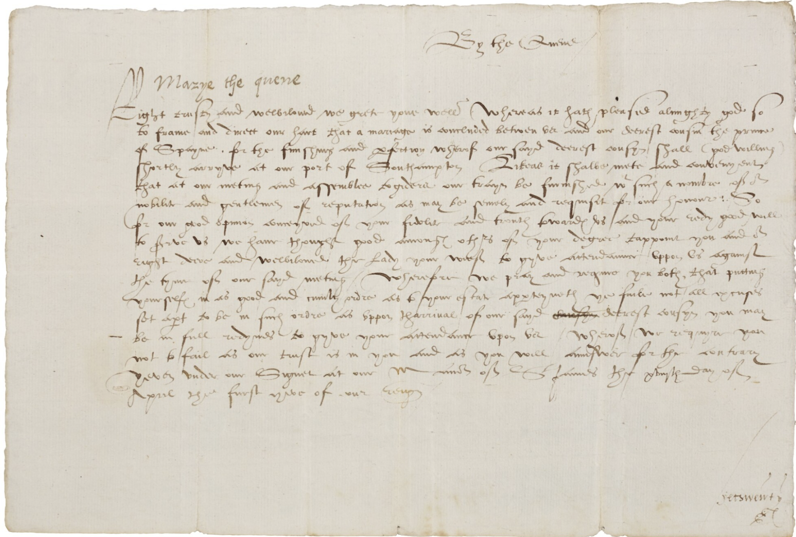

```{r}
#| echo: false
#| results: false
#| warning: false
#| message: false
rm(list=ls())
library(tidyverse)
library(readxl)
data <- read_excel("data/paisley-data.xlsx")
```

Being familiar with R and RStudio makes it easy to integrate prose and the results of computational analyses (tables, visualisations, etc.) using **Quarto**.[^1] Quarto allows creating fully reproducible documents that can then easily be exported into different formats (Word, PDF, etc.). As well as regular documents, Quarto can create presentations, books, websites, blogposts, interactive visualisations and web applications. Given that Quarto documents also runs the code and prints the results in the RStudio console, they can also be used as a way of scripting your work.

[^1]: Quarto is an open-source publishing system built on [Pandoc](https://pandoc.org) and authored using [Markdown](https://en.wikipedia.org/wiki/Markdown).]

The following seeks to provide a short introduction, especially aimed at historians, covering the basics.[^2] 

[^2]: As well as this [Quarto tutorial](https://quarto.org/docs/get-started/hello/rstudio.html) itself, you can check @hadley2023 [ch. 28-29] and @alexander2023 [ch. 3] for an introduction on how to integrate R code in Quarto documents.

# Getting started

Quarto documents have the extension `.qmd` and can be opened as a new file using the menu or its corresponding <kbd>{width="15" height="15"}</kbd> icon. You will be prompted to a new window where you can define the title (and the author), as well as specify to which format you will want the document to be rendered. Let's just click "Create": a new Quarto file will be added as a new tab, named "Untitled1". 

The new file, the source document, is actually not totally blank. The top part will look like this:

``` yaml
---
title: "Untitled"
format: html
---
```

The section enclosed between three dashes (`---`) is called the YAML header and defines how the final document will look like. Given that in the previous pop-up window, we didn't specify a title, the option title says "Untitled". If we had indicated a title, it would appear here. The previous pop-up window also had "html" selected as the recommended format, so the YAML header also specifies this will the format to which the document will be rendered to. As we will discover later, there are many more features that can be explicitly set up in the YAML. For now, we will accept what is defined by default. 

The text of the document itself is defined after the second set of three dashes (`---`) and is populated with different things that act as a sort of template that the reader can follow to get her started. For instance, different sub-sections are created using `##` and some text is set to be printed in bold by enclosing it between double asterisks. It also includes two examples of code blocks, one of them including an option to hide the code in the rendered version of the document.

# Rendering

Rendering involves taking the information contained in the source document and export it into a different format (i.e. html, pdf, etc.), as specified in the YAML. The code embedded in the code blocks is also executed, so the output also forms part of the final document. As mentioned above, you can actually decide whether to include the code and/or the output for each code chunk separately. Note also that rendering creates new file(s) that will be stored in the root folder.[^3]

[^3]: Note that .html files will be stored in a subfolder called `docs`.

To see how it works, click the <kbd>{width="15" height="15"}</kbd> **Render** button in RStudio. Quarto will generate a new file containing what is in the .qmd file. Given that `format: html`, a html file will be created in your own server. The title ("Untitled") will appear at the top of the rendered document and what is typed after the YAML header will follow a bit below. Take a moment to inspect it and compare it with the source document.

You can create documents in other formats just by setting `format` to `pdf` (PDF) or `docx` (Word) in the YAML. Note however that creating PDFs requires [LaTeX](https://www.latex-project.org), which needs to be installed. In order to do so, type the following command in the Terminal window:

``` {.bash filename="Terminal"}
quarto install tinytex
```

Feel free now to change the `format` in the yaml to `pdf` and create one yourself. 

Notice that some commands that may work well when interacting directly with Quarto may cause trouble when rendering, especially to pdf. For instance, the command `View(data)` opens up a RStudio data viewer in a different another tab, which is very useful for exploring how the data frame looks like but it may conflict with rendering since this additional tab cannot be rendered. If you want to show the reader how the data looks like just type the name of the object in a code chunk (potentially in combination with `print()` and perhaps also `select()` to only look into particular fields). Printing very long textual fields might also be problematic, so you may want to restrict the number of characters you want to print using, for instance, `str_sub(1,200)`. 

# Authoring

Rather than using menus as in Word documents, Quarto relies on plain text source code to format the document. This implies following some conventions (Markdown syntax) depending on how you want your text to look like. It takes a while to get used to write in plain text but it comes with some advantages: light weight, publish online documents, reproducibility, etc. Below you can find some basic conventions to add format to your texts:

1. Change the text style by enclosing it with asterisks: `*italics*`, `**bold**` or `***bold italics***`. Likewise, formatting text as a superscript involves enclosing it between carets: `the 18^th^ century`.

2. Underline or highlight a particular text, enclosed between squared brackets, by adding {.underline} or {.mark}. The following, for instance, will underline the enclosed text: `` [This text is underlined]{.underline} ``. It is also possible to highlight particular terms using `` `verbatim code` ``. The latter is usually done to refer to R packages and functions.

4. Sections and subsections are denoted by adding one, two or more hashtags (`#`). They form a nested structure: while different sections will be created using one (`#`), subsections will need two (`##`). More hashtags are added if you want to keep adding lower levels.

5. Footnotes are added by opening it with a `^` and enclosing the text between square brackets: `blablabla.^[Text of the footnote.]` The footnote will be automatically numbered accordingly.

6. Include links to other websites by enclosing between square brackets and including the link immediately after between parentheses: `...check the [course website](https://fjbeltrantapia.github.io/computational-history/)`.

7.  Check [here](https://quarto.org/docs/authoring/markdown-basics.html#lists) to see how to create list with unordered or ordered items.

8. Introduce comments that are ignored when rendering. The following, for instance, would show up in your quarto document but not printed in the rendered PDF: <!-- Remember to check the original source --> Remember to both open (`<!--`) and close the comment (`-->`).

You can also check the Quarto guide for [Markdown style](https://quarto.org/docs/authoring/markdown-basics.html), the following guide created by Sarah Simpkin for the [Programming Historian](https://programminghistorian.org/en/lessons/getting-started-with-markdown) or Jesse Sadler's [course notes](https://jessesadler.github.io/vt5454-s24/guides/markdown-syntax.html).

## Images

Inserting images can also be very useful if you want, for instance, to show how your source looks like. The code below inserts the file `letter-mary.png`, stored in the folder `images`. While the text between squared brackets defines the figure caption, the options enclosed between curly brackets `{}` label the figure and adjust its size.^[Note that the figure caption starts with `Figure 1`. Quarto will automatically number all images, graphs, etc. (unless you explicitly instruct otherwise).]

``` markdown
{#fig-letter width=50%}
```
{#fig-letter width=50%}

There are in any case many different possibilities, so you should check [here](https://quarto.org/docs/authoring/figures.html) if you plan to insert several figures simultaneously or play around with other options.

## Equations

Equations and numerical expressions, based on LaTeX, can be inserted by enclosing them between one or two dollar signs (`$`) depending on whether it is displayed within a line or paragraph (inline) or apart from the main text. See, for instance, how the following code is rendered:

``` markdown
$$
y_i = a_i + b_i \cdot x_i + e
$$
```

$$
y_i = a_i + b_i \cdot x_i + e
$$

There are many conventions to write equations in LaTeX. For more details, see the Quarto documentation [here](https://quarto.org/docs/get-started/authoring/rstudio.html#equations).

# Code chunks

One of the biggest advantages of using Quarto documents is that it supports executable code blocks, so you can embed code and output and create fully reproducible documents (the code required to produce the output is part of the document itself).^[As well as R, Quarto can work with other programming languages like Python, Julia and JavaScript.] R code chunks are identified with ```` ```{r} ```` and can be introduced manually or using the appropriate icon. Do not forget to close it using three backticks ```` ``` ````. 

```{{r}}
library(tidyverse)
library(readxl)
data <- read_excel("data/paisley-data.xlsx")
data |> count(sex)
```

Code blocks will be executed by Quarto when rendering. However, you can independently run the code without the need for rendering the whole document. You can therefore interactively check if the code works and tinker with it at will until you are satisfied. In order to do so, click the  icon or keyboard shortcut. RStudio will execute the code and display the results.

By default, both the code and its output are displayed in the resulting document. It is however possible to hide the code and/or the subsequent results for each code chunk separately. This is done by including different chunk options after the symbol `#|` at the top of the chunk: while `echo: false` will hide the code, `results: false` will suppress the output. Similarly, you can hide other warnings and messages that sometimes pop up when running your code. As shown below, this can also be set up within the `yaml`, so it applies to all code chunks within the project (the behaviour set up in individual blocks will override the yaml set up).

```{{r}}
#| echo: false
#| results: false
#| warning: false
#| message: false

CODE HERE
```

As illustrated in the code block below, you can also provide titles (captions) for the tables or visualisations that the code produces, as well as labelling them. The latter allows cross referencing them within the text itself. Typed in the text itself, the following, for instance, would refer to the table created below: `As shown in @tbl-freq-sex, blablabla.`. By automatically numbering and providing hyperlinks to figures, tables, and so on, cross-referencing helps structuring and navigating your document. Note that the label must uniquely identify the entity (which also needs a caption). Similarly, the options `fig-width` and `fig-height` define the size of the graph, wich is set to by default. There are many different chunk options depending on what you want to do: check [here](https://quarto.org/docs/get-started/computations/rstudio.html#multiple-figures), for instance, if you want to include multiple figures simultaneously.

```{{r}}
#| warning: false
#| label: fig-scatterplot
#| fig-cap: "Age and weight in the Paisley data set."
#| fig-width: 6
#| fig-height: 3.5 

data |>
  ggplot(aes(x = age, y = weight)) +
  geom_point()
```

```{r}
#| warning: false
#| echo: false
#| label: fig-scatterplot
#| fig-cap: "Age and weight in the Paisley data set."
#| fig-width: 6
#| fig-height: 3.5 

data |>
  ggplot(aes(x = age, y = weight)) +
  geom_point()
```

## Inline code

Sometimes, you will want to include executable expressions within the text itself. The code should be enclosed within `` `{r} ` ``. For example, you can write the following when reporting how many prisoners the Paisley data contains. 

````markdown
There are `{{r}} nrow(data)` prisoners in the Paisley data.
````

> There are `{r} nrow(data)` prisoners in the Paisley data.

The rendered document won't show the expression inside the backticks above but the actual number of observations. You can write the actual number yourself but this may come in handy when you are playing around with different data sets (or samples) simultaneously. 

For more complex expressions, it is possible to have hidden code chunks (`echo: false`) that assign the results to an object, so it can be called using inline code. See below for a different way of doing what we did above, plus reporting the average age for male and female prisoners.^[Note that we need to use `pull()` to transform the tibble generated by `summarize()` into a numeric object.]

```{r}
obs <- data |> nrow()
avg_age_male <- data |> filter(sex=="male") |> 
  summarise(mean = mean(age, na.rm = TRUE)) |> pull(mean) |> round(1)
avg_age_female <- data |> filter(sex=="female") |> 
  summarise(mean = mean(age, na.rm = TRUE)) |> pull(mean) |> round(1)
```

```markdown
There are `{{r}} obs` prisoners in the Paisley data. The average age is `{{r}} avg_age_male` and `{{r}} avg_age_female` for men and women, respectively. 
```

> There are `{r} obs` prisoners in the Paisley data. The average age is `{r} avg_age_male` and `{r} avg_age_female` for men and women, respectively. 


# YAML and YAML Header

As mentioned above, the section enclosed between three dashes (`---`) is called the **YAML header** and serves to configure how the source document is processed and how the final document will look like. 

``` yaml
---
title: "Computational history"
author: "John Smith"
format: html
---
```

As well as specifying title (and the author) of the document, the YAML defines the `format` to which the document will be rendered to. There are however many other features that can be configured through the YAML that shape the way the document is rendered. They basically constitute a set of instructions that indicate Quarto how to process and present the document. Most of them are pre-defined by default but you can explicitly define them to fit your needs. The example below, for instance, defines font size an margins length, as well as automatically adding a table of contents and/or section numbering to better structure the document. We are also indicating which file stores the list of references that the document relies on (more on this below). There exists a wide range of options for customizing your document via the `yaml`.

``` yaml
---
title: "Computational history"
format: 
  pdf:
    fontsize: 11
    toc: true
    number-sections: true
    geometry:
      - top=30mm
      - left=30mm
bibliography: refs.bib
---
```

The different available options for the YAML fields are slightly different depending on whether you are creating [HTML](/docs/reference/formats/html.qmd), [PDF](/docs/reference/formats/pdf.qmd) or [MS Word](/docs/reference/formats/docx.qmd) documents. While the one above is aimed at producing a PDF file, the one below sets instructions for a html file.

``` yaml
---
title: "Computational history"
format: 
  html:
    theme: cosmo
    code-fold: true # adds a code fold button
    code-copy: true # adds a copy button to code blocks
toc: true
number-sections: true
bibliography: refs.bib
---
```

Crucially, you can also indicate that you want to hide all code chunks from the rendered document within `execute`. This option can be overturned in each individual code block though by setting `echo: true` there.

``` yaml
---
title: "Computational history. Session 1"
author: "John Smith"
format: pdf
execute:
  echo: false
---
```

## Project-level YAML

For simple documents, having a **YAML header**, demarcated by three dashes `---` at the top of the document as shown above, is enough. However, for more complex documents or projects (i.e. books, websites, etc.), it is advisable to have a **project-level YAML**, stored in a file named `_quarto.yml` which lives in the root directory of the project. This set of instructions applies to every .qmd file in the project but can be override by document-level yamls or code chunk options.

# Referencing

Quarto relies on `.bib` files to be able to cross reference citations and create a reference list. Each reference is stored following this type of structure, that differs slightly depending whether you are referencing a book, a journal article, a website or other type of material:

``` yaml
@book{guldi2023,
	title = {The dangerous art of text mining},
	publisher = {Cambridge University Press},
	author = {Guldi, Jo},
	year = {2023},
}

@article{mccants2020,
	title = {Economic history and the historians},
	volume = {50},
	number = {4},
	journal = {Journal of Interdisciplinary History},
	author = {McCants, Anne E.C.},
	year = {2020},
	pages = {547--566},
}
```

Programmes like Zotero or help creating this type of .bib documents. You can also manually add references to the .bib document. Note that .bib documents can be reused and their contents copied and pasted into other documents. Having them will therefore save you tons of time when creating your reference lists in the future. 

You can call this file `references.bib` (or `refs.bib`). You will need to specifically indicate in the YAML that your bibliography is stored in that document: 

``` yaml
---
title: "Computational history"
format: pdf
bibliography: refs.bib
---
```

You can then easily cite those references in the text using the `@citeid` syntax. There are different ways of citing. See the differences below

``` markdown
As @guldi2023 [p. 10] argues blablabla.
```

> As @guldi2023 [p. 10] argues blablabla.

``` markdown
Computational methods are crucial for historians [@guldi2023, p. 10].
```

> Computational methods are crucial for historians [@guldi2023, p. 10].

All items refer to in the text will be compiled into the reference list, which will be automatically added at the end of the document. If you want to add a section title, you can do the following at the end of your .qmd file:

``` markdown
# References {.unnumbered}

::: {#refs}
:::
```

This will suffice for our purposes. This is in any case just a taste. If you want to learn more and discover all the different possibilities, check the [program documentation](https://quarto.org/docs/guide/) or this [Hello Quarto](https://mine.quarto.pub/hello-quarto/#/hello-quarto-title) presentation. It should nonetheless be stressed that RStudio allows seeing the document in "source" or "visual" mode. The latter gives you a sense of how the source document will look like when rendered. It also allows using toolbars for formatting (similar to a Word document). The underlying plain text source code will be written for you, so it might be a way to learn how to use it. You can switch between the two modes at your wish.